<div align="center">

# 🚀 The Complete Visual Guide to Efficient Attention

### *From Quadratic Bottlenecks to Linear-Time Transformers*

[](https://attention-survey.github.io/files/Attention_Survey.pdf)
[](https://attention-survey.github.io)

---

*A comprehensive visual journey through four classes of efficient attention:*  
*Hardware-efficient • Compact • Sparse • Linear Attention*

</div>

---

## 📖 Table of Contents

- [Introduction: The Attention Revolution](#-introduction-the-attention-revolution)
- [The Quadratic Bottleneck Problem](#-the-quadratic-bottleneck-problem)
- [Standard Attention: Step by Step](#-standard-attention-step-by-step)
- [GPU Memory Hierarchy](#-gpu-memory-hierarchy)
- [Attention in Different Tasks](#-attention-in-different-tasks)
- [The Four Classes Overview](#-the-four-classes-overview)
- [Complete Methods Taxonomy](#-complete-methods-taxonomy)
- [Class 1: Hardware-efficient Attention](#-class-1-hardware-efficient-attention)
  - [Prefilling Stage Formulation](#prefilling-stage-formulation)
  - [Decoding Stage Formulation](#decoding-stage-formulation)
- [Class 2: Compact Attention](#-class-2-compact-attention)
  - [Compact Attention Formulation](#compact-attention-formulation)
- [Class 3: Sparse Attention](#-class-3-sparse-attention)
  - [Sparse Attention Formulation](#sparse-attention-formulation)
- [Class 4: Linear Attention](#-class-4-linear-attention)
  - [Linear Attention with Gates](#linear-attention-with-gates)
  - [Three Computational Forms](#three-computational-forms)
  - [Gating Mechanisms Deep Dive](#gating-mechanisms-deep-dive)
  - [Linear Attention Methods by Gate Type](#linear-attention-methods-by-gate-type)
- [Test-Time Training (TTT)](#-test-time-training-ttt)
- [Complexity Comparison](#-complexity-comparison)
- [Practical Decision Guide](#-practical-decision-guide)
- [All Visualizations](#-all-visualizations)
- [Citation](#-citation)

---

## 🌟 Introduction: The Attention Revolution

Transformers have fundamentally changed AI, powering everything from GPT-4 to AlphaFold. At the heart of their success lies the **self-attention mechanism** — a brilliant architecture that allows each token to attend to every other token in a sequence.

But this power comes at a cost: **quadratic complexity**. As we push toward longer contexts (128K, 1M, or even infinite tokens), this becomes a critical bottleneck.

This guide explores four distinct approaches researchers have developed to tackle this challenge, each with unique trade-offs between speed, memory, and model quality.

---

## 🔥 The Quadratic Bottleneck Problem

The standard self-attention formula is deceptively simple:

<div align="center">
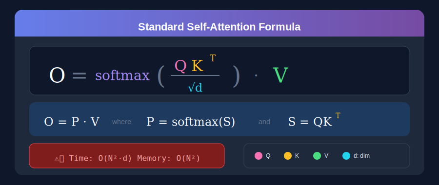
</div>

### Why It's Quadratic

| Component | Operation | Complexity |
|-----------|-----------|------------|
| **S = QKᵀ** | Matrix multiply (N×d) × (d×N) | O(N²d) |
| **P = softmax(S)** | Row-wise softmax on N×N matrix | O(N²) |
| **O = PV** | Matrix multiply (N×N) × (N×d) | O(N²d) |

### The Memory Explosion

| Sequence Length | Attention Matrix Size | Memory (FP16) | Practical? |
|-----------------|----------------------|---------------|------------|
| 1K tokens | 1 Million elements | ~2 MB | ✅ Easy |
| 8K tokens | 64 Million elements | ~128 MB | ✅ OK |
| 32K tokens | 1 Billion elements | ~2 GB | ⚠️ Challenging |
| 128K tokens | 16 Billion elements | ~32 GB | 🔥 Very Hard |
| 1M tokens | 1 Trillion elements | ~2 TB | 💀 Impossible |

**This is why we desperately need efficient attention methods!**

---

## 🔍 Standard Attention: Step by Step

Before diving into solutions, let's understand exactly what happens in standard attention:

<div align="center">
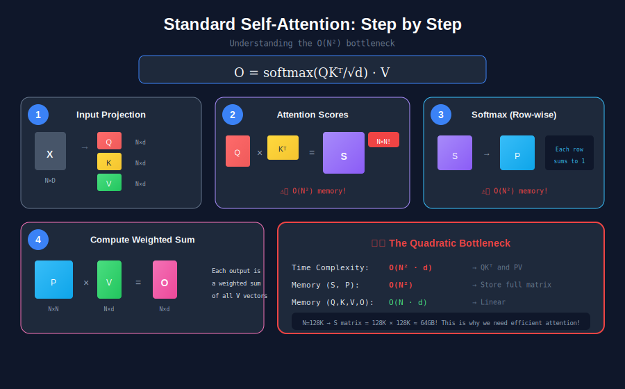
</div>

### The Four Critical Steps

1. **Input Projection** — Project input X into Query (Q), Key (K), and Value (V) matrices using learned weights
2. **Attention Scores** — Compute S = QKᵀ/√d, creating the problematic N×N matrix
3. **Softmax Normalization** — Apply row-wise softmax to get attention weights P (another N×N matrix!)
4. **Weighted Sum** — Compute output O = P·V

**The bottleneck is clear**: Steps 2 and 3 create N×N matrices that explode with sequence length.

---

## 🖥️ GPU Memory Hierarchy

Understanding **why** attention is slow requires understanding GPU architecture:

<div align="center">
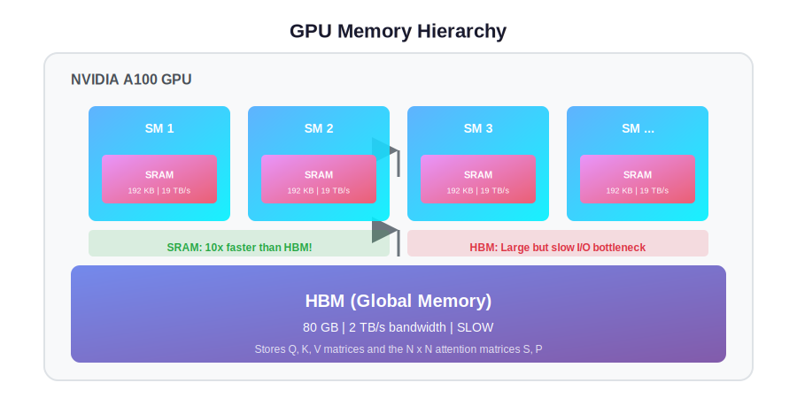
</div>

### Key Concepts

| Memory Type | Size | Bandwidth | Characteristic |
|-------------|------|-----------|----------------|
| **HBM (Global Memory)** | ~80 GB | ~2 TB/s | Large but slow |
| **SRAM (Shared Memory)** | ~192 KB per SM | ~19 TB/s | 10× faster! |

### Why This Matters for Attention

1. **Naive Attention**: Writes the N×N matrices (S, P) to slow HBM repeatedly
2. **FlashAttention**: Keeps everything in fast SRAM using tiling
3. **Result**: Same computation, but memory-bound → compute-bound!

### Compute-Bound vs Memory-Bound

| Phase | Bottleneck | Optimization Strategy |
|-------|------------|----------------------|
| Training | **Compute** | Maximize parallel processing |
| Prefilling | **Compute** | Better tiling, quantization |
| Decoding | **Memory** | Reduce KV cache I/O |

---

## 📋 Attention in Different Tasks

The same attention mechanism behaves differently across tasks:

<div align="center">
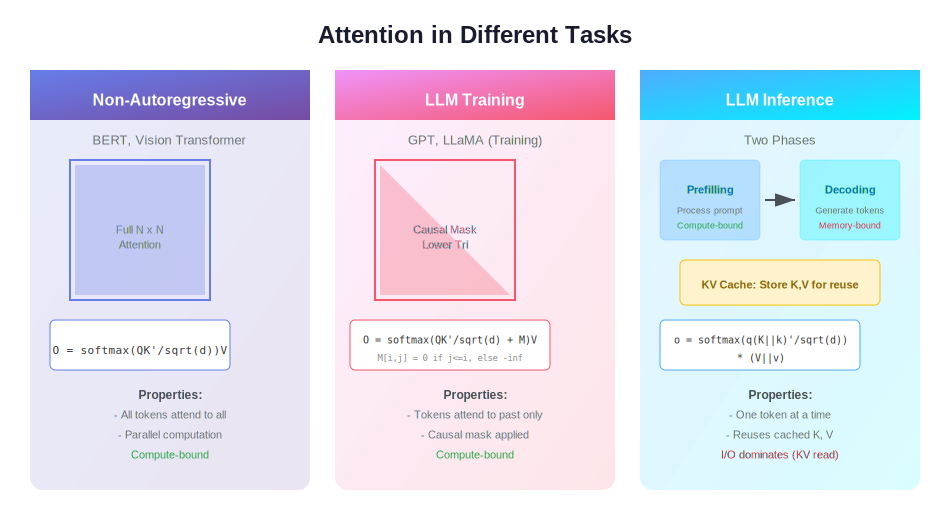
</div>

### Non-Autoregressive Models (BERT, ViT)

- **Pattern**: Full attention — every token attends to every other token
- **Formula**: `O = softmax(QKᵀ/√d) × V`
- **Characteristic**: **Compute-bound** (parallel processing)

### LLM Training (Causal)

- **Pattern**: Lower-triangular causal mask
- **Formula**: `O = softmax(QKᵀ/√d + M) × V` where M prevents future attention
- **Characteristic**: **Compute-bound** (still parallel within constraints)

### LLM Inference (Two Phases)

| Phase | Description | Bottleneck |
|-------|-------------|------------|
| **Prefilling** | Process entire prompt, build KV cache | Compute-bound |
| **Decoding** | Generate tokens one by one, reuse KV cache | **Memory-bound** (KV cache I/O) |

This is why **different optimization strategies** are needed for each phase!

---

## 🎯 The Four Classes Overview

All efficient attention methods fall into four fundamental categories:

<div align="center">
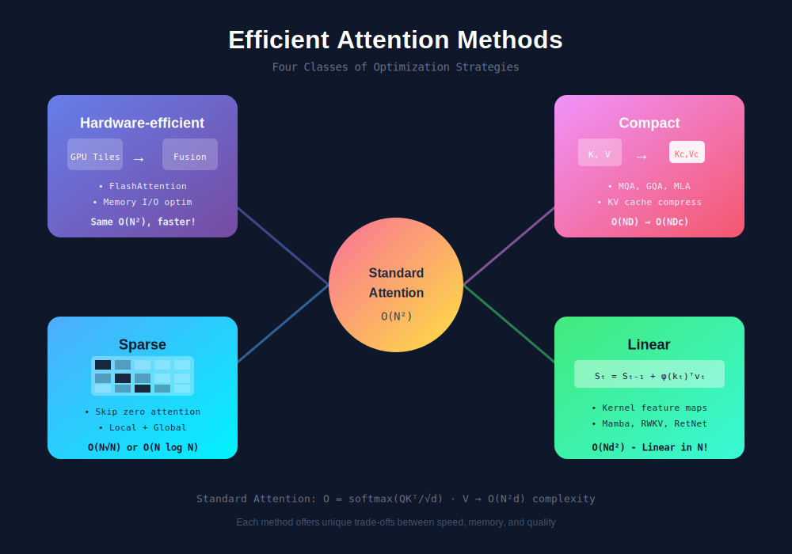
</div>

| Class | Core Strategy | Time | Memory | Quality |
|-------|---------------|------|--------|---------|
| **Hardware-efficient** | Optimize GPU memory I/O | O(N²d) | O(N) | Exact ✓ |
| **Compact** | Compress KV cache | O(N²d) | O(NDc) | ~Exact |
| **Sparse** | Skip zero attention | O(N·k) | O(N·k) | Approximate |
| **Linear** | Kernel approximation | O(Nd²) | O(d²) | Approximate |

---

## 📚 Complete Methods Taxonomy

Here's the complete landscape of efficient attention methods:

<div align="center">
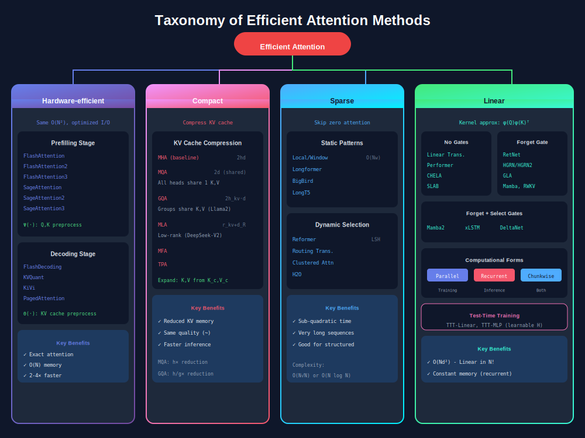
</div>

---

## ⚡ Class 1: Hardware-efficient Attention

> **Core Idea**: Same exact computation, but optimized for GPU memory hierarchy

<div align="center">

</div>

### 💡 The Key Insight

Modern GPUs have a memory hierarchy that most implementations ignore:

| Memory Type | Size | Bandwidth | Access |
|-------------|------|-----------|--------|
| **HBM (Global)** | ~80 GB | ~2 TB/s | Slow |
| **SRAM (On-chip)** | ~20 MB | ~19 TB/s | 10× faster! |

Standard attention reads/writes the N×N matrices to slow HBM. **FlashAttention** tiles the computation so intermediate results stay in fast SRAM.

### Prefilling Stage Formulation

The prefilling stage processes the full input prompt in parallel:

<div align="center">
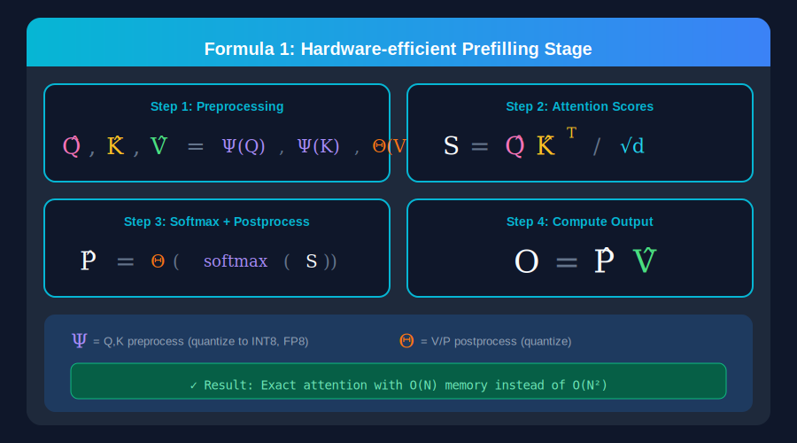
</div>

**Key components:**
- **Ψ(·)** — Preprocessing function for Q, K (e.g., INT8/FP8 quantization in SageAttention)
- **Θ(·)** — Postprocessing function for V, P (e.g., dequantization)

### Decoding Stage Formulation

The decoding stage generates tokens one at a time:

<div align="center">
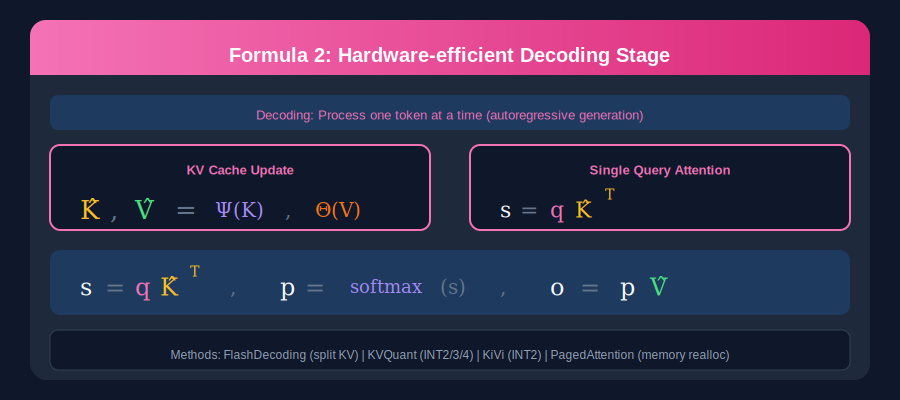
</div>

### 📊 Methods Comparison

| Method | Stage | Innovation | Speedup |
|--------|-------|------------|---------|
| **FlashAttention** | Prefilling | Tiling + Online Softmax | 2-4× |
| **FlashAttention2** | Prefilling | Better parallelism | 2× over FA1 |
| **FlashAttention3** | Prefilling | FP8 + Hopper optimizations | 1.5-2× over FA2 |
| **SageAttention** | Prefilling | INT8 quantization | 2.5× over FA2 |
| **SageAttention2** | Prefilling | INT4/FP8 mixed precision | 3× over FA2 |
| **FlashDecoding** | Decoding | KV parallelism | 8× on long contexts |
| **PagedAttention** | Decoding | Virtual memory for KV | Better batching |

### 🏆 Result

**Exact attention with O(N) memory instead of O(N²)!** No approximation, just better engineering.

---

## 📦 Class 2: Compact Attention

> **Core Idea**: Compress the KV cache through weight sharing or low-rank decomposition

<div align="center">

</div>

### 💡 The Key Insight

In Multi-Head Attention, each of the h heads maintains separate K, V matrices. This is wasteful because:
- Keys and Values across heads are often **similar**
- We can **share** or **compress** them!

### Compact Attention Formulation

<div align="center">
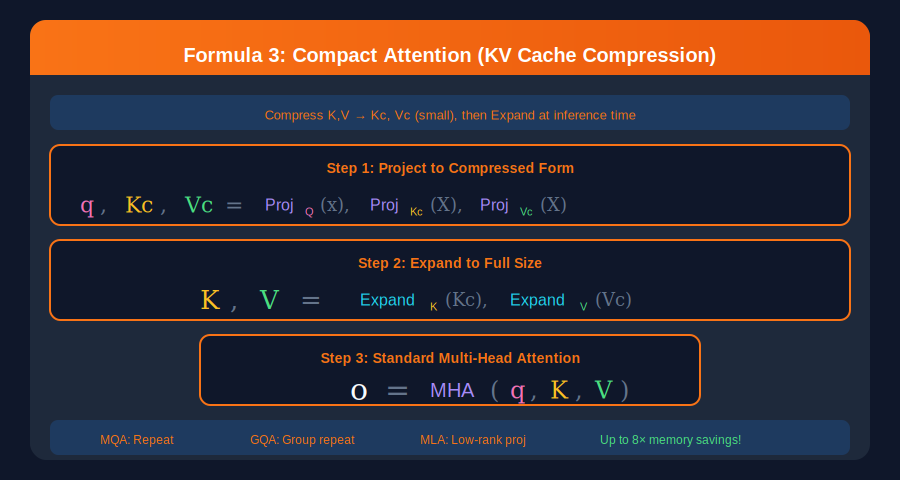
</div>

### 📊 Methods Comparison

| Method | KV Cache Size | Reduction | Used By |
|--------|--------------|-----------|---------|
| **MHA** (baseline) | 2 × h × d | 1× | GPT-3, BERT |
| **MQA** | 2 × d | h× | PaLM, Gemma |
| **GQA** | 2 × h_kv × d | h/h_kv× | Llama 2/3 |
| **MLA** | r_kv + d_R | Variable | DeepSeek-V2 |

### 🏆 Real-World Impact

**Llama 2 (70B)** uses GQA with:
- 64 query heads, 8 KV heads
- **8× reduction** in KV cache memory
- Enables 128K context on consumer GPUs!

---

## 🎯 Class 3: Sparse Attention

> **Core Idea**: Not all tokens need to attend to all other tokens — skip the zeros!

<div align="center">

</div>

### 💡 The Key Insight

After softmax, most attention weights are **near zero**. Computing these is wasteful! We can predetermine sparse patterns to skip computations.

### Sparse Attention Formulation

<div align="center">
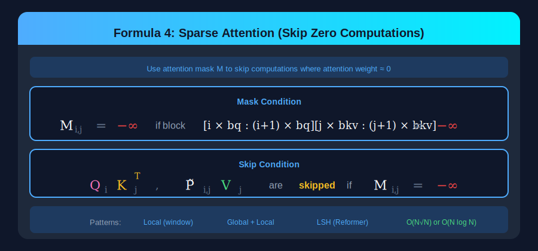
</div>

### 📊 Sparse Pattern Types

#### 1️⃣ Local (Window) Attention
- Each token attends only to **w** nearby tokens
- Complexity: **O(N × w)** instead of O(N²)
- Best for: Sequential data with local dependencies

#### 2️⃣ Global + Local
- Special tokens (like [CLS]) attend **globally**
- Other tokens use **local windows**
- Best for: Document understanding, classification

#### 3️⃣ Dynamic Selection
- **Learn** which tokens to attend to
- Content-aware sparsity
- Best for: Variable-length dependencies

### 📊 Methods Comparison

| Method | Pattern | Complexity | Best For |
|--------|---------|------------|----------|
| **Longformer** | Local + Global | O(N·w + N·g) | Document NLP |
| **BigBird** | Local + Global + Random | O(N·(w+g+r)) | General |
| **Reformer** | LSH clustering | O(N log N) | Very long |
| **H2O** | Heavy Hitter Oracle | O(N·k) | KV cache eviction |

---

## 🔄 Class 4: Linear Attention

> **Core Idea**: Approximate softmax to achieve O(N) complexity — truly linear in sequence length!

### Linear Attention with Gates

Modern linear attention uses gates to control information flow:

<div align="center">
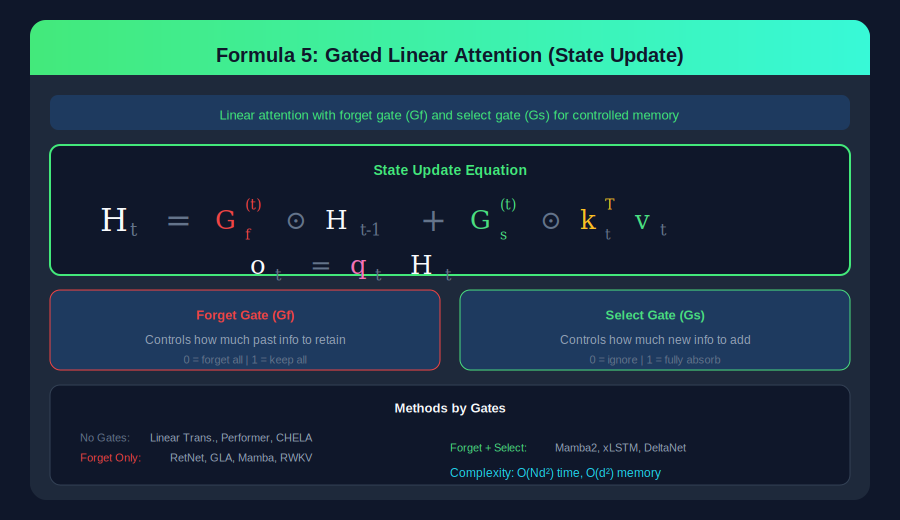
</div>

### 💡 The Key Insight

Standard attention: softmax(QKᵀ) prevents associativity

If we approximate: **softmax(QKᵀ) ≈ φ(Q)·φ(K)ᵀ**

Then we can compute: **O = φ(Q)·(φ(K)ᵀV)**

The inner term φ(K)ᵀV is only **d×d**, not N×N!

### Three Computational Forms

Linear attention can be computed in three equivalent forms:

<div align="center">

</div>

| Form | Best For | Complexity | Parallelism |
|------|----------|------------|-------------|
| **Parallel** | Training | O(Nd²) total | Full GPU |
| **Recurrent** | Inference | O(d²) per step | Sequential |
| **Chunkwise** | Both | O(NC + Cd²) | Hybrid |

### Gating Mechanisms Deep Dive

<div align="center">

</div>

#### Why Gates Matter

Basic linear attention accumulates **everything forever**. Gates let the model:

- **Forget Gate (Gf)**: How much past information to retain
  - Near 1: Keep previous state
  - Near 0: Forget/decay memory
  
- **Select Gate (Gs)**: How much new information to add
  - Near 1: Fully absorb new token
  - Near 0: Ignore/filter token

#### Classification by Gates

| Gate Configuration | Methods | Characteristics |
|-------------------|---------|-----------------|
| **No Gates** | Linear Transformer, Performer, CHELA | Simple, may struggle with forgetting |
| **Forget Only** | RetNet, HGRN, GLA, Mamba, RWKV | Exponential decay of past |
| **Forget + Select** | Mamba2, xLSTM, DeltaNet | Full control over information flow |

### Linear Attention Methods by Gate Type

Here's a comprehensive view of linear attention methods organized by their gate configuration:

<div align="center">
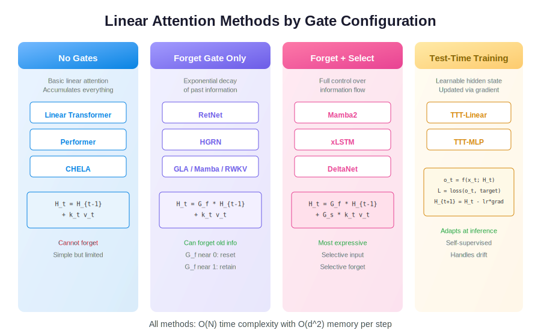
</div>

### Method Details

| Category | Method | Key Innovation | Use Case |
|----------|--------|---------------|----------|
| **No Gates** | Linear Transformer | Replace softmax with kernel | General |
| | Performer | FAVOR+ random features | Long sequences |
| | CHELA | Chunk-wise linear attention | Efficiency |
| **Forget Gate** | RetNet | Retention with decay | Language modeling |
| | RWKV | WKV operator, RNN-like | Open-source LLM |
| | Mamba | Selective state space | General LLM |
| | GLA | Gated linear attention | Efficient training |
| **Forget + Select** | Mamba2 | Improved Mamba | General LLM |
| | xLSTM | Extended LSTM | Long sequences |
| | DeltaNet | Delta rule update | Efficient inference |

---

## 🎓 Test-Time Training (TTT)

> **Core Idea**: Make the hidden state learnable and update it during inference!

<div align="center">

</div>

### 💡 The Revolutionary Insight

Standard linear attention computes H deterministically. TTT instead:

1. Treats H as **learnable parameters**
2. Uses **self-supervised loss** during inference
3. Updates H with **gradient descent** at test time!

### The TTT Algorithm

```
For each token x_t:
  1. Forward:  o_t = f(x_t; H_t)
  2. Loss:     L = self_supervised_loss(o_t, target)
  3. Update:   H_{t+1} = H_t - η · ∇_H L
```

### 🏆 Why It Works

- **Adapts** to input distribution at test time
- Handles **distribution shift** gracefully
- Combines **learning** (adaptation) with **efficiency** (linear time)

### Methods

| Method | Hidden State | Update Rule |
|--------|-------------|-------------|
| **TTT-Linear** | Linear layer | Gradient descent |
| **TTT-MLP** | MLP | Gradient descent |

---

## 📊 Complexity Comparison

<div align="center">
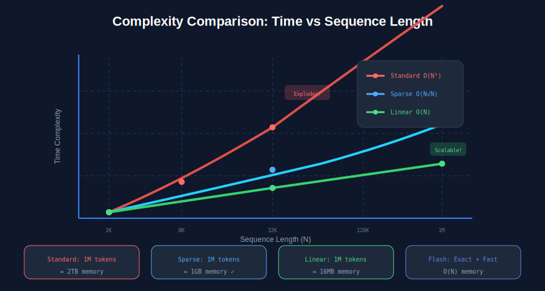
</div>

### Detailed Comparison

| Method | Time | Memory | Quality | Use Case |
|--------|------|--------|---------|----------|
| **Standard** | O(N²d) | O(N²) | Exact | Short sequences |
| **FlashAttention** | O(N²d) | O(N) | Exact | General (default choice!) |
| **Sparse (window)** | O(N·w) | O(N·w) | Approximate | Very long, structured |
| **Sparse (dynamic)** | O(N log N) | O(N) | Approximate | Variable dependencies |
| **Linear** | O(Nd²) | O(d²) | Approximate | Streaming, SSMs |
| **Compact (GQA)** | O(N²d) | O(N·d_c) | ~Exact | Long context LLMs |

---

## 🎯 Practical Decision Guide

```
┌─────────────────────────────────────────────────────────┐
│                  Need Efficient Attention?              │
└─────────────────────────┬───────────────────────────────┘
                          │
        ┌─────────────────┴─────────────────┐
        │                                   │
        ▼                                   ▼
   Exact Attention?                   Approximate OK?
        │                                   │
        ▼                                   ▼
   FlashAttention                    What's your priority?
   (always a good start!)                   │
                          ┌─────────────────┼─────────────────┐
                          │                 │                 │
                          ▼                 ▼                 ▼
                    Very Long           Streaming/         Memory
                    Sequences          Real-time         Constrained
                    (100K+)                                  
                          │                 │                 │
                          ▼                 ▼                 ▼
                    Sparse Attention   Linear Attention   Compact Attention
                    (Longformer,       (Mamba, RWKV,     (GQA, MLA,
                     BigBird)          RetNet)           MQA)
```

### Quick Recommendations

| Scenario | Recommended Approach |
|----------|---------------------|
| **General use, any length** | FlashAttention2/3 |
| **LLM inference optimization** | GQA + FlashDecoding |
| **128K+ context** | GQA + Sparse + Flash |
| **Streaming/real-time** | Mamba2 or RWKV |
| **Document understanding** | Longformer or BigBird |
| **Maximum throughput** | SageAttention2 |

---

## 📁 All Visualizations

All diagrams are available in the `svg_figs/` folder:

### Conceptual Diagrams

| File | Description |
|------|-------------|
| `overview_attention_types.svg` | Four-quadrant overview of efficient attention classes |
| `standard_attention_explained.svg` | Step-by-step breakdown of standard attention |
| `methods_taxonomy.svg` | Complete hierarchical taxonomy of all methods |
| `complexity_comparison.svg` | Time complexity comparison graph |
| `gpu_memory_hierarchy.svg` | GPU memory architecture (HBM vs SRAM) |
| `attention_tasks.svg` | Attention in different tasks (training, inference) |

### Method-Specific Diagrams

| File | Description |
|------|-------------|
| `flash_attention.svg` | FlashAttention tiling & GPU memory hierarchy |
| `compact_attention.svg` | KV cache compression (MQA, GQA, MLA) |
| `sparse_attention.svg` | Sparse patterns (Local, Global, Dynamic) |
| `linear_attention_forms.svg` | Parallel, Recurrent, Chunkwise forms |
| `gating_mechanisms.svg` | Forget & Select gates in linear attention |
| `linear_attention_methods.svg` | All linear attention methods by gate type |
| `test_time_training.svg` | TTT concept with learnable hidden states |

### Formula Visualizations

| File | Description |
|------|-------------|
| `formula_standard_attention.svg` | O = softmax(QKᵀ/√d)·V with color coding |
| `formula_prefilling.svg` | Hardware-efficient prefilling stage |
| `formula_decoding.svg` | Hardware-efficient decoding stage |
| `formula_compact_attention.svg` | Compact attention KV compression |
| `formula_sparse_attention.svg` | Sparse attention mask formulation |
| `formula_linear_attention.svg` | Gated linear attention state update |

---

## 📚 Key Takeaways

### 1. There's No One-Size-Fits-All

Each class offers unique trade-offs:
- **Hardware-efficient**: Best quality, good speed
- **Compact**: Great for memory-constrained inference
- **Sparse**: Best for very long sequences with structure
- **Linear**: Best for streaming and state space models

### 2. Start with FlashAttention

Unless you have specific requirements, FlashAttention is the safest default:
- No quality loss
- 2-4× faster
- Works with any model

### 3. Hybrid Approaches Win

Modern systems often combine approaches:
- **Llama 3**: GQA + FlashAttention
- **Gemini**: Sparse + Flash + Custom kernels
- **Claude**: Proprietary combinations

### 4. The Future is Linear?

Linear attention methods (Mamba, RWKV) are gaining traction for:
- True O(N) scaling
- Streaming capabilities
- State space model connections

---

## 📚 References

This study guide is based on:

> **Efficient Attention Methods: Hardware-efficient, Sparse, Compact, and Linear Attention**  
> Zhang, Jintao et al.  
> [Paper](https://attention-survey.github.io/files/Attention_Survey.pdf) | [Website](https://attention-survey.github.io)

---

<div align="center">

**[📄 Read the Full Paper](https://attention-survey.github.io/files/Attention_Survey.pdf)** | **[🌐 Visit Website](https://attention-survey.github.io)**

---

*All visualizations are crisp for any screen size*

</div>
