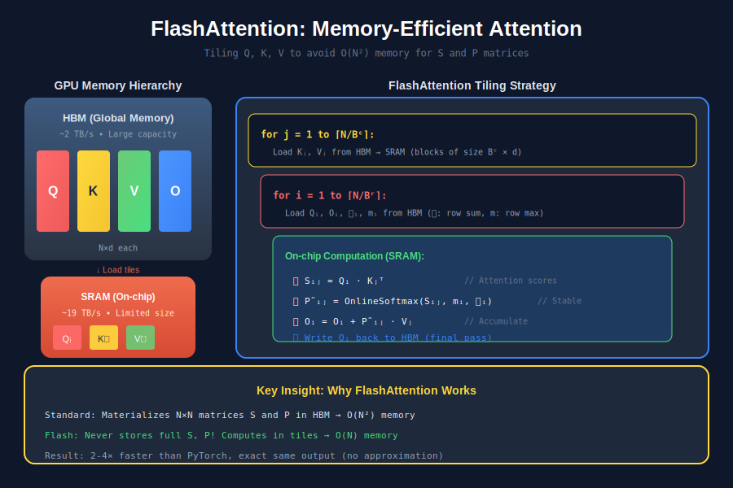
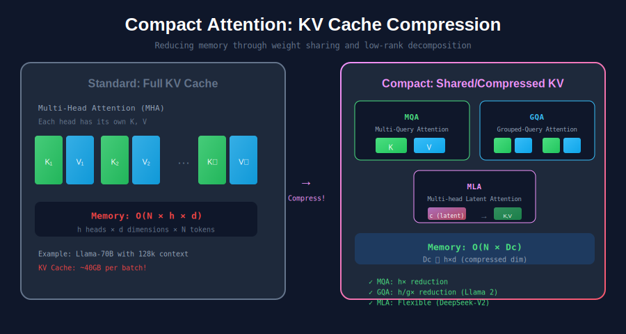
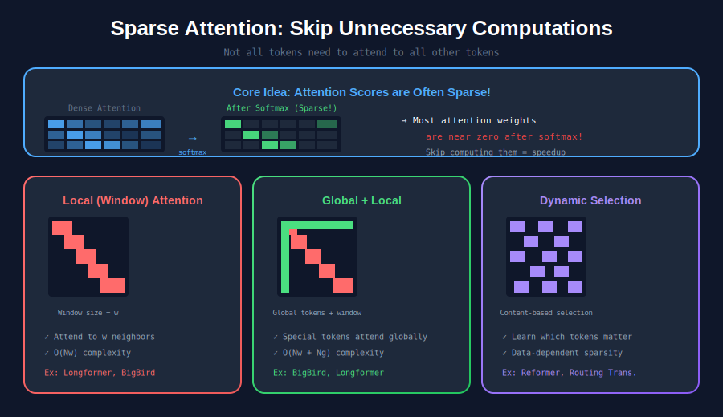
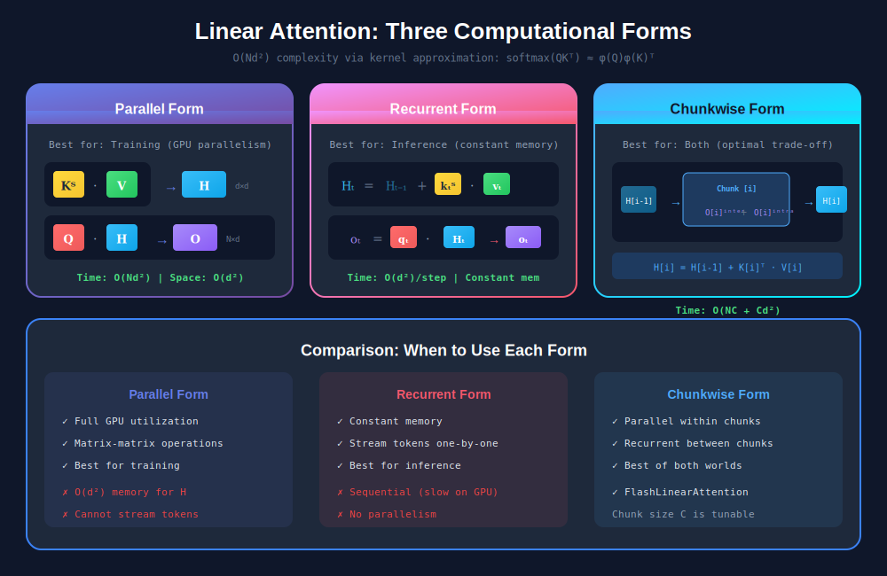
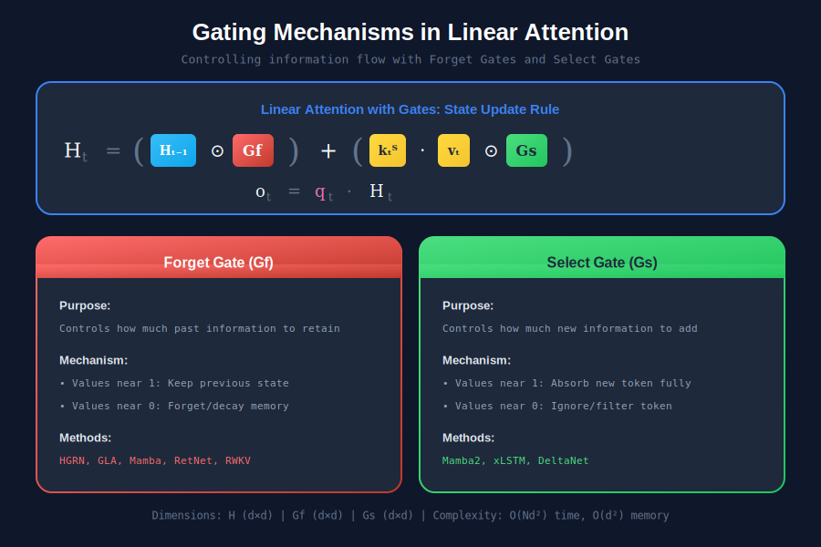
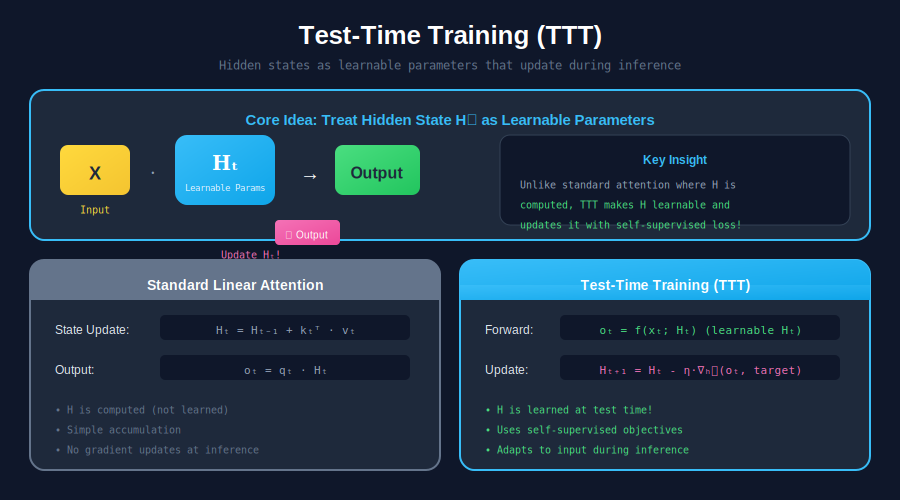

# 🚀 Efficient Attention Methods Survey

### *Hardware-efficient, Sparse, Compact, and Linear Attention*

---

*A comprehensive visual guide to making attention O(n) without sacrificing quality*

---

## 📖 [Read the Full Visual Blog Guide →](./BLOG_README.md)

---

## 🎯 Overview

This study guide covers **four classes of efficient attention methods** that tackle the quadratic complexity bottleneck:

<table>
<tr>
<td width="50%">

### ⚡ Hardware-efficient Attention
Optimize GPU memory I/O patterns

**Key Methods:**
- FlashAttention 1/2/3
- SageAttention
- FlashDecoding
- PagedAttention

</td>
<td width="50%">

### 📦 Compact Attention
Compress KV cache through sharing

**Key Methods:**
- MQA (Multi-Query)
- GQA (Grouped-Query)
- MLA (Multi-head Latent)

</td>
</tr>
<tr>
<td width="50%">

### 🎯 Sparse Attention
Skip zero attention weights

**Key Methods:**
- Longformer
- BigBird
- H2O (Heavy Hitter Oracle)

</td>
<td width="50%">

### 🔄 Linear Attention
Kernel approximation for O(N)

**Key Methods:**
- Mamba / Mamba2
- RWKV
- RetNet
- xLSTM

</td>
</tr>
</table>

---

## 🔥 The Quadratic Bottleneck Problem

| Sequence Length | Attention Matrix Size | Memory (FP16) | Practical? |
|-----------------|----------------------|---------------|------------|
| 1K tokens | 1 Million elements | ~2 MB | ✅ Easy |
| 8K tokens | 64 Million elements | ~128 MB | ✅ OK |
| 32K tokens | 1 Billion elements | ~2 GB | ⚠️ Challenging |
| 128K tokens | 16 Billion elements | ~32 GB | 🔥 Very Hard |
| 1M tokens | 1 Trillion elements | ~2 TB | 💀 Impossible |

**This is why we need efficient attention methods!**

---

## ⚡ Class 1: Hardware-efficient Attention

💡 **Core Idea**: Accelerate attention by leveraging GPU memory hierarchy (HBM vs SRAM).

**Key Innovation**: Tile the computation so intermediate N×N matrices stay in fast SRAM instead of slow HBM.

---

## 📦 Class 2: Compact Attention

💡 **Core Idea**: Compress KV cache by sharing K,V across attention heads.

| Method | KV Heads | Reduction | Used By |
|--------|----------|-----------|---------|
| **MHA** | h | 1× | GPT-3, BERT |
| **MQA** | 1 | h× | PaLM |
| **GQA** | h/g | g× | Llama 2/3 |

---

## 🎯 Class 3: Sparse Attention

💡 **Core Idea**: Not all tokens need to attend to all others — skip the zeros!

**Patterns:**
- **Local Window**: Attend to neighboring tokens only
- **Global Tokens**: Special tokens attend to everything
- **Dynamic**: Learn which tokens to attend

---

## 🔄 Class 4: Linear Attention

💡 **Core Idea**: Approximate softmax to achieve O(N) complexity.

### Computational Forms

| Form | Best For | Complexity |
|------|----------|------------|
| **Parallel** | Training | O(Nd²) total |
| **Recurrent** | Inference | O(d²) per step |
| **Chunkwise** | Both | Hybrid |

### Gating Mechanisms

| Gate Type | Methods |
|-----------|---------|
| **No Gates** | Linear Transformer, Performer |
| **Forget Only** | RetNet, Mamba, RWKV, GLA |
| **Forget + Select** | Mamba2, xLSTM, DeltaNet |

---

## 🎓 Test-Time Training (TTT)

A unique approach that treats hidden states as **learnable parameters** updated during inference.

---

## 📊 Complexity Comparison

| Method | Time | Memory | Quality |
|--------|------|--------|---------|
| **Standard** | O(N²d) | O(N²) | Exact |
| **FlashAttention** | O(N²d) | O(N) | Exact |
| **Sparse** | O(N·k) | O(N·k) | Approximate |
| **Linear** | O(Nd²) | O(d²) | Approximate |
| **Compact** | O(N²d) | O(N·d_c) | ~Exact |

---

## 🎯 Quick Decision Guide

| Scenario | Recommendation |
|----------|----------------|
| **General use** | FlashAttention2/3 |
| **LLM inference** | GQA + FlashDecoding |
| **128K+ context** | GQA + Sparse + Flash |
| **Streaming** | Mamba2 or RWKV |
| **Documents** | Longformer / BigBird |

---

## 📁 Visualizations

All diagrams available in `svg_figs/`:

| File | Description |
|------|-------------|
| `overview_attention_types.svg` | Four classes overview |
| `flash_attention.svg` | FlashAttention mechanism |
| `compact_attention.svg` | MQA, GQA, MLA comparison |
| `sparse_attention.svg` | Sparse patterns |
| `linear_attention_forms.svg` | Parallel, Recurrent, Chunkwise |
| `gating_mechanisms.svg` | Forget and select gates |
| `test_time_training.svg` | TTT approach |
| `formula_*.svg` | Mathematical formulations |

---

## 📚 References

This study guide is based on:

> **Efficient Attention Methods: Hardware-efficient, Sparse, Compact, and Linear Attention**  
> Zhang, Jintao et al.  
> [Paper](https://attention-survey.github.io/files/Attention_Survey.pdf) | [Website](https://attention-survey.github.io)

---

### 📖 [Read the Complete Visual Blog →](./BLOG_README.md)

