# 🚀 A Practical Survey on Faster and Lighter Transformers

> **Fournier, Q., Caron, G. M., & Aloise, D. (2023)** - ACM Computing Surveys  
> *A comprehensive visual guide to making Transformers efficient for real-world deployment*

---

## 📋 Table of Contents

1. [Introduction: Why Efficiency Matters](#introduction-why-efficiency-matters)
2. [The Transformer Architecture](#the-transformer-architecture)
3. [Understanding the Bottleneck](#understanding-the-bottleneck)
4. [Taxonomy of Efficiency Methods](#taxonomy-of-efficiency-methods)
5. [General Approaches](#general-approaches)
   - [Gradient Checkpointing & Reversible Layers](#gradient-checkpointing--reversible-layers)
   - [Knowledge Distillation](#knowledge-distillation)
   - [Quantization](#quantization)
   - [Pruning](#pruning)
   - [Weight Sharing](#weight-sharing)
   - [Mixture of Experts (MoE)](#mixture-of-experts-moe)
   - [Micro-Batching (GPipe)](#micro-batching-gpipe)
6. [Efficient Attention Mechanisms](#efficient-attention-mechanisms)
   - [Sparse Attention](#sparse-attention)
   - [Low-Rank Factorization](#low-rank-factorization)
   - [Kernel-based Linear Attention](#kernel-based-linear-attention)
7. [Memory-based Architectures](#memory-based-architectures)
8. [Combining Techniques](#combining-techniques)
9. [Comprehensive Comparison](#comprehensive-comparison)
10. [Conclusion](#conclusion)

---

## Introduction: Why Efficiency Matters

The Transformer architecture has revolutionized AI, achieving state-of-the-art results across NLP, computer vision, speech recognition, and biological sequence analysis. But this power comes at a cost:

- **GPT-3** requires **355 years** on a single V100 GPU, costing **~$4.6 million**
- Sequence lengths are limited to ~512 tokens on 16GB GPUs
- Training large models creates significant **carbon footprint**

This survey investigates how to make Transformers **faster** and **lighter** without sacrificing performance.

<p align="center">
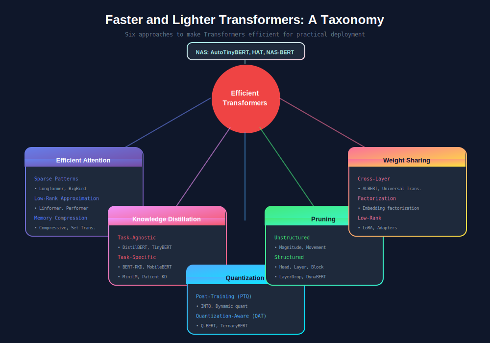
</p>

The paper categorizes solutions into **six main approaches**:
1. **Efficient Attention** - Reduce O(n²) complexity
2. **Knowledge Distillation** - Transfer knowledge to smaller models
3. **Quantization** - Reduce numerical precision
4. **Pruning** - Remove redundant weights
5. **Weight Sharing** - Share parameters across layers
6. **Neural Architecture Search** - Automatically find efficient designs

---

## The Transformer Architecture

Before optimizing, we must understand what we're optimizing. The Transformer replaced sequential RNNs with parallel self-attention:

<p align="center">
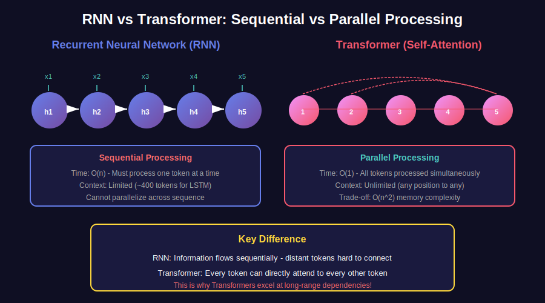
</p>

The Transformer consists of stacked encoder and decoder layers, each containing self-attention and feed-forward networks.

<p align="center">
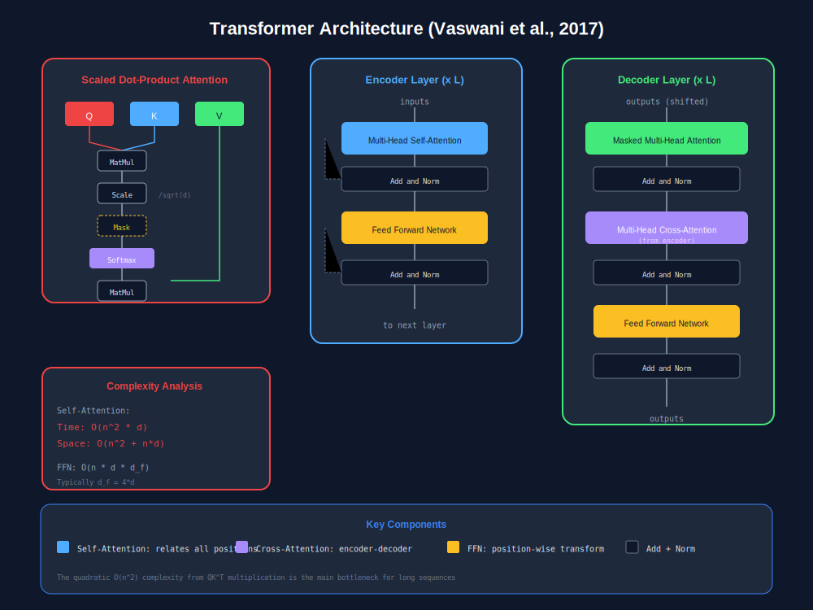
</p>

### The Core: Attention Mechanism

The attention mechanism is the heart of the Transformer. Here are the key equations:

<p align="center">
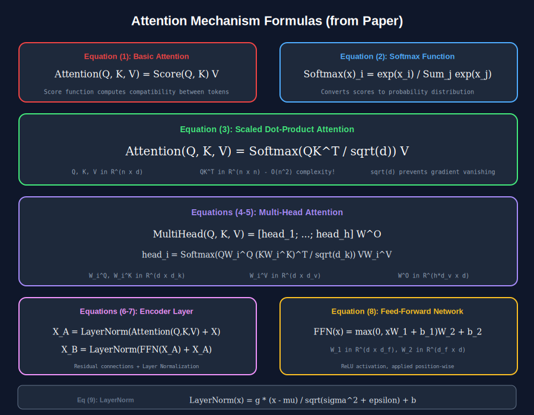
</p>

**The Equations Explained:**

| Equation | Formula | Purpose |
|----------|---------|---------|
| **(1)** | Attention(Q,K,V) = Score(Q,K)V | Basic attention |
| **(2)** | Softmax(x)ᵢ = exp(xᵢ)/Σexp(xⱼ) | Probability distribution |
| **(3)** | Attention = Softmax(QKᵀ/√d)V | Scaled dot-product |
| **(4-5)** | MultiHead = [head₁;...;headₕ]Wᴼ | Multi-head attention |
| **(6-7)** | LayerNorm(Attention + X) | Residual + normalization |
| **(8)** | FFN(x) = ReLU(xW₁+b₁)W₂+b₂ | Position-wise FFN |

<p align="center">
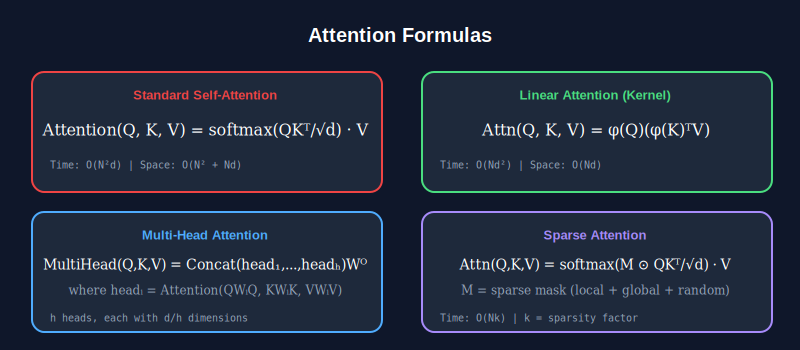
</p>

---

## Understanding the Bottleneck

The **quadratic complexity** emerges from the QKᵀ multiplication, which computes scores between all n² pairs of positions.

<p align="center">
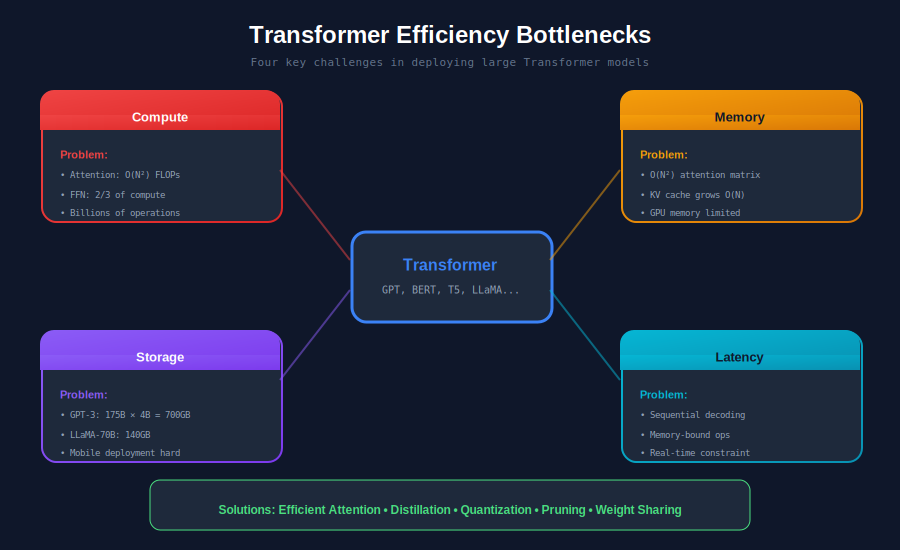
</p>

### Four Key Challenges:

| Challenge | Problem | Impact |
|-----------|---------|--------|
| **Compute** | O(n²) attention FLOPs | Slow training/inference |
| **Memory** | O(n²) attention matrix | Limited batch/sequence size |
| **Storage** | Billions of parameters | Deployment difficulty |
| **Latency** | Sequential decoding | Real-time constraints |

<p align="center">
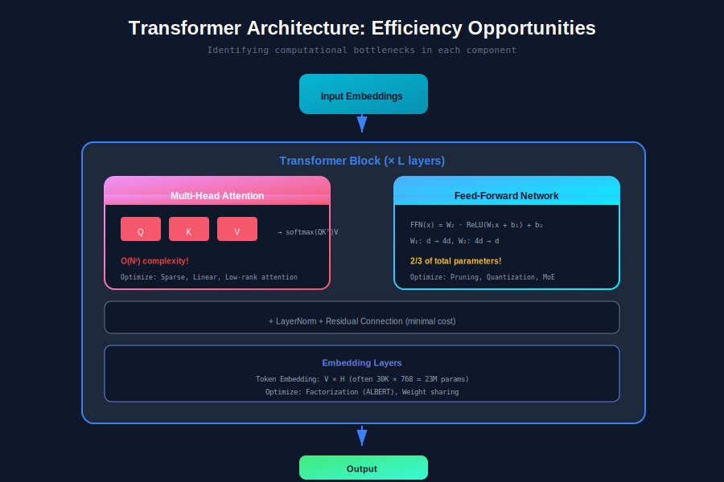
</p>

---

## Taxonomy of Efficiency Methods

The paper organizes efficiency methods into a clear taxonomy:

<p align="center">
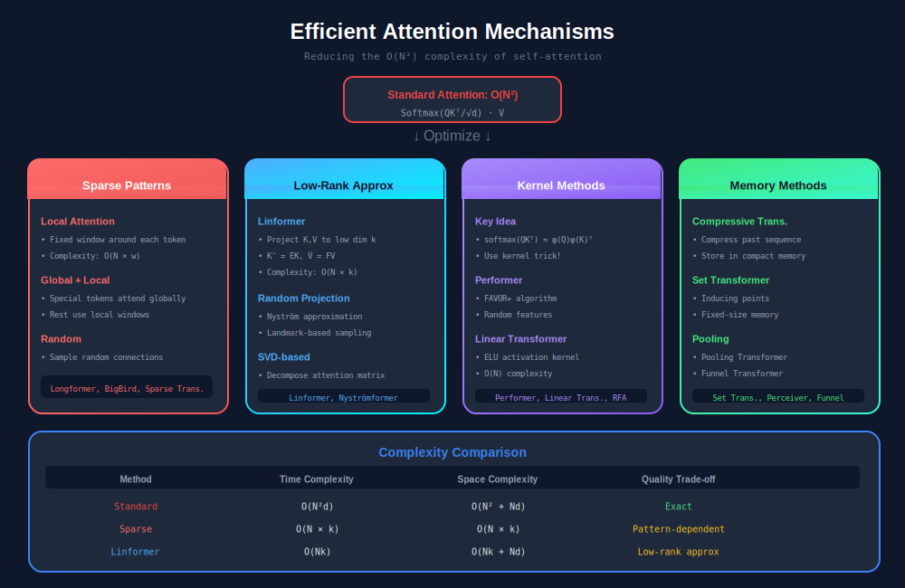
</p>

---

## General Approaches

These methods apply to **any neural network** and can often be combined:

<p align="center">
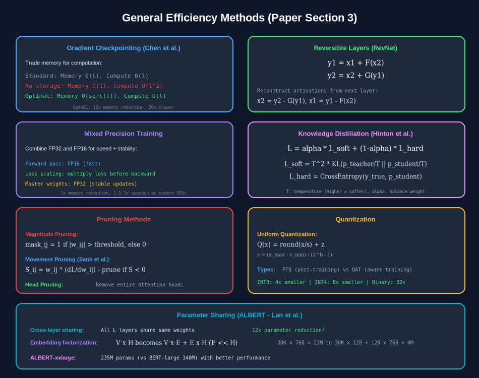
</p>

---

### Gradient Checkpointing & Reversible Layers

Memory is often the bottleneck when training deep Transformers. These techniques trade computation for memory:

<p align="center">
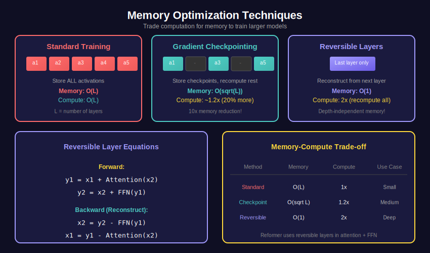
</p>

**Key Insight:** During backpropagation, we need activations from the forward pass. Instead of storing all of them:
- **Checkpointing**: Store only some activations, recompute the rest (10× memory reduction, 20% more compute)
- **Reversible Layers**: Reconstruct any layer's input from its output (used in Reformer)

---

### Knowledge Distillation

Transfer knowledge from a large **teacher** model to a smaller **student** model:

<p align="center">
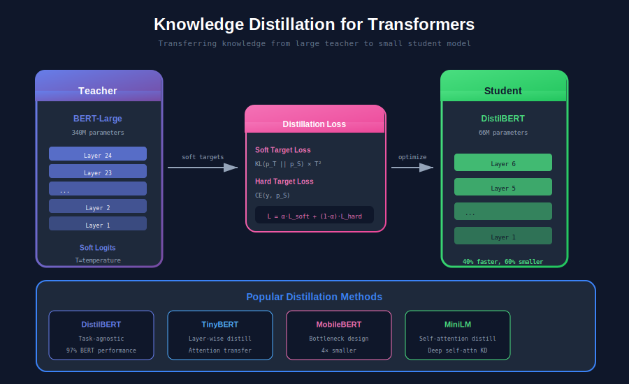
</p>

**The Distillation Loss:**

<p align="center">
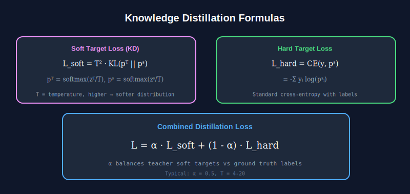
</p>

```
L = α × L_soft + (1-α) × L_hard

L_soft = T² × KL(p_teacher/T || p_student/T)
L_hard = CrossEntropy(y_true, p_student)
```

**Key Parameters:**
- **T (Temperature)**: Higher = softer probability distribution
- **α**: Balance between teacher's soft targets and ground truth

**Popular Distilled Models:**

| Model | Compression | Performance |
|-------|-------------|-------------|
| DistilBERT | 40% smaller | 97% of BERT |
| TinyBERT | 7.5× smaller | 96% of BERT |
| MobileBERT | 4× smaller | 99% of BERT |
| MiniLM | Variable | 99%+ |

---

### Quantization

Reduce numerical precision to compress models and accelerate inference:

<p align="center">
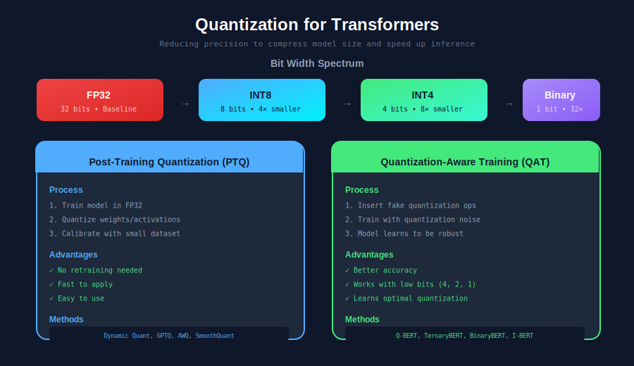
</p>

**Quantization Formulas:**

<p align="center">
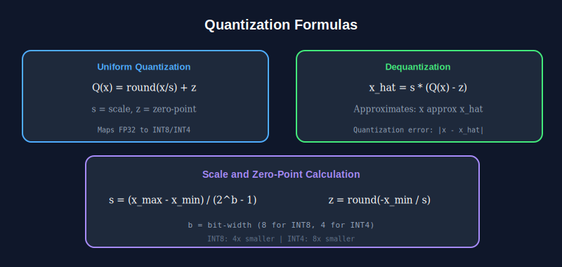
</p>

```
Quantize:   Q(x) = round(x/s) + z
Dequantize: x̂ = s × (Q(x) - z)

Scale: s = (x_max - x_min) / (2^b - 1)
```

**Two Main Approaches:**

| Approach | Description | Pros | Cons |
|----------|-------------|------|------|
| **PTQ** (Post-Training) | Quantize after training | Fast, easy | Some accuracy loss |
| **QAT** (Quantization-Aware) | Train with fake quantization | Better accuracy | Requires retraining |

**Compression by Bit Width:**

| Precision | Size Reduction | Speed Improvement |
|-----------|---------------|-------------------|
| FP32 | 1× (baseline) | 1× |
| FP16 | 2× | ~2× |
| INT8 | 4× | 2-4× |
| INT4 | 8× | 4-8× |
| Binary | 32× | 10-20× |

---

### Pruning

Remove redundant weights, heads, or layers:

<p align="center">
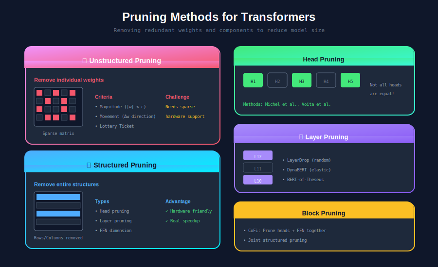
</p>

**Pruning Formulas:**

<p align="center">
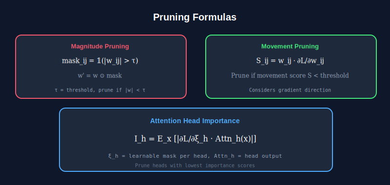
</p>

**Pruning Strategies:**

| Type | What's Removed | Hardware Friendly? |
|------|----------------|-------------------|
| **Unstructured** | Individual weights | No (needs sparse support) |
| **Structured** | Entire heads/layers | Yes (real speedup) |
| **Head Pruning** | Attention heads | Yes |
| **Layer Pruning** | Entire layers | Yes |

**Key Finding:** Studies show **20-40% of attention heads** can be pruned with minimal impact!

---

### Weight Sharing

Share parameters across layers or factorize large matrices:

<p align="center">
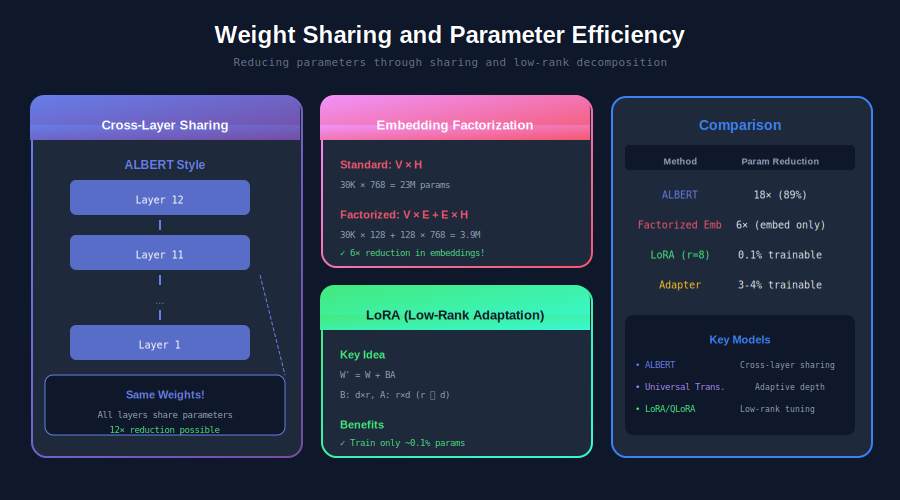
</p>

**ALBERT's Innovations:**

1. **Cross-layer sharing**: All 12/24 layers share the same weights
   - Result: **12-18× parameter reduction!**

2. **Embedding factorization**: V×H → V×E + E×H
   - 30K × 768 = 23M → 30K × 128 + 128 × 768 = 4M
   - Result: **6× smaller embeddings**

**Modern Approaches:**
- **LoRA**: Add low-rank adapters, train only 0.1% of parameters
- **Adapters**: Insert small trainable modules (3-4% parameters)

---

### Mixture of Experts (MoE)

Scale model capacity without increasing per-token computation:

<p align="center">
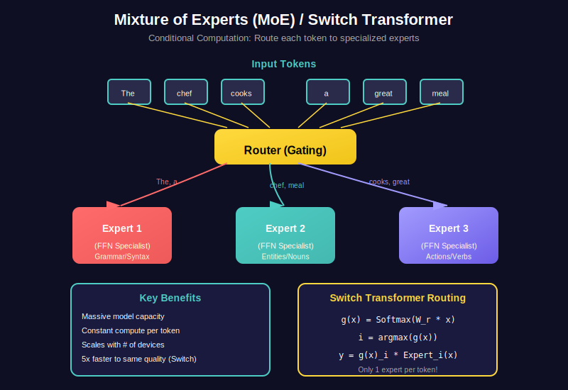
</p>

**How it works:**
- Replace FFN with multiple "expert" FFNs
- A router selects which expert(s) to use for each token
- Only 1-2 experts are active per token (sparse activation)

**Switch Transformer Results:**
- 5× faster training to reach same quality
- Scales to **trillion-parameter** models
- Each device holds different experts (scales with hardware)

---

### Micro-Batching (GPipe)

Train massive models across multiple devices with pipeline parallelism:

<p align="center">
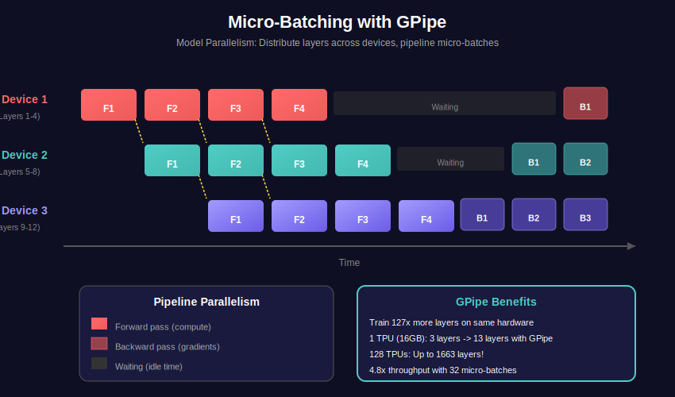
</p>

**Key Benefits:**
- Split model layers across devices
- Pipeline micro-batches to reduce idle time
- 127× more layers trainable on same hardware!

---

## Efficient Attention Mechanisms

The core innovation: reduce the O(n²) self-attention complexity.

---

### Sparse Attention

Instead of attending to all positions, use structured sparsity patterns:

<p align="center">
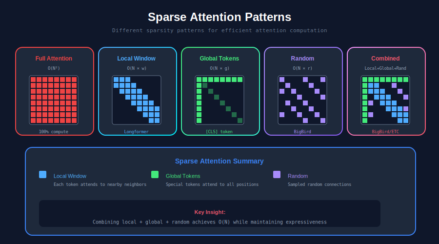
</p>

**Detailed Sparse Patterns (from paper Figures 5, 15, 17):**

<p align="center">
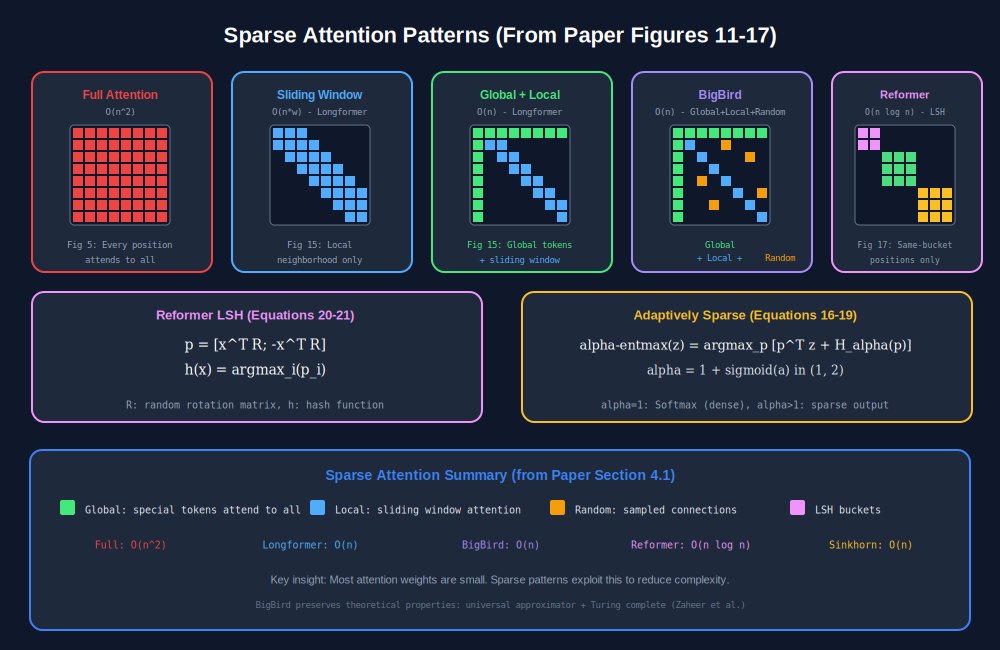
</p>

**Pattern Types:**

| Pattern | Description | Models |
|---------|-------------|--------|
| **Local Window** | Attend to neighboring positions | Longformer |
| **Global Tokens** | Special tokens attend to all | Longformer, BigBird |
| **Random** | Sampled random connections | BigBird |
| **LSH Buckets** | Hash similar queries together | Reformer |

**Longformer (Beltagy et al.):**
- Sliding window attention: O(n × w)
- Global tokens for [CLS], etc.
- **Complexity: O(n)**

**BigBird (Zaheer et al.):**
- Combines: Global + Local + Random
- Proven: Universal approximator + Turing complete
- **Key finding**: Random attention often unnecessary!

**Reformer (Kitaev et al.):**
```
p = [xᵀR; -xᵀR]
h(x) = argmax_i(p_i)
```
- LSH groups similar queries/keys
- Only same-bucket positions attend
- **Complexity: O(n log n)**

---

### Low-Rank Factorization

Approximate the n×n attention matrix with lower-rank factors:

<p align="center">
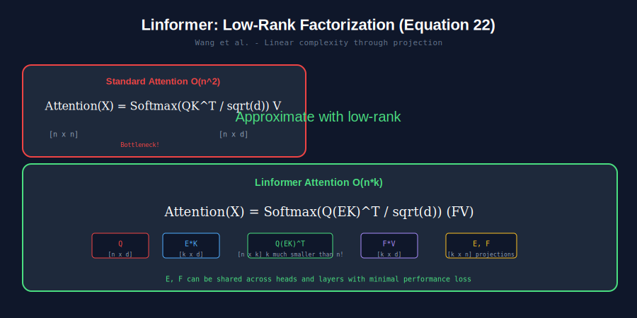
</p>

**Linformer (Wang et al.) - Equation 22:**
```
Standard:  Softmax(QKᵀ/√d)V        → O(n²)
Linformer: Softmax(Q(EK)ᵀ/√d)(FV) → O(nk)
```

Where E, F ∈ R^(k×n) project K, V to dimension k ≪ n

**Key insight**: E, F can be **shared across heads and layers** with minimal performance loss!

**Synthesizers (Tay et al.):**

<p align="center">
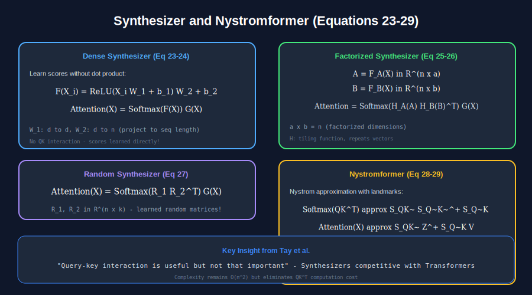
</p>

```
Dense Synthesizer:
F(X_i) = ReLU(X_i W₁ + b₁) W₂ + b₂
Attention(X) = Softmax(F(X)) G(X)

Random Synthesizer:
Attention(X) = Softmax(R₁ R₂ᵀ) G(X)
```

**Revolutionary finding**: "Query-key interaction is useful but **not that important**"

---

### Kernel-based Linear Attention

The most elegant solution: use the kernel trick to achieve true O(n) complexity!

<p align="center">
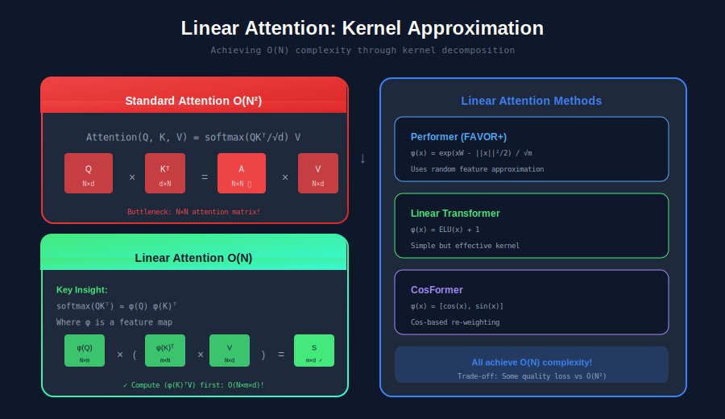
</p>

**Performer (Choromanski et al.):**

<p align="center">
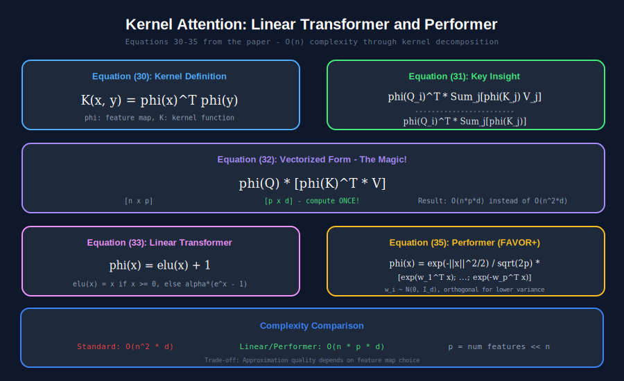
</p>

**The Key Insight (Equations 30-32):**
```
softmax(QKᵀ) ≈ φ(Q) φ(K)ᵀ
```

**The Magic - Rearrange computation:**
```
Standard:   Q × (K^T × V)
            [n×d] × ([d×n] × [n×d]) = [n×n] × [n×d] → O(n²)

Linear:     φ(Q) × [φ(K)ᵀ × V]
            [n×p] × [p×d] → O(npd) where p ≪ n
```

Compute `φ(K)ᵀ × V` **once** for all queries!

**Feature Maps:**

| Model | Feature Map φ(x) | Complexity |
|-------|------------------|------------|
| Linear Transformer | elu(x) + 1 | O(n) |
| Performer (FAVOR+) | Random orthogonal features | O(n) |
| CosFormer | [cos(x), sin(x)] | O(n) |

---

## Memory-based Architectures

For very long sequences, use memory to extend context:

<p align="center">
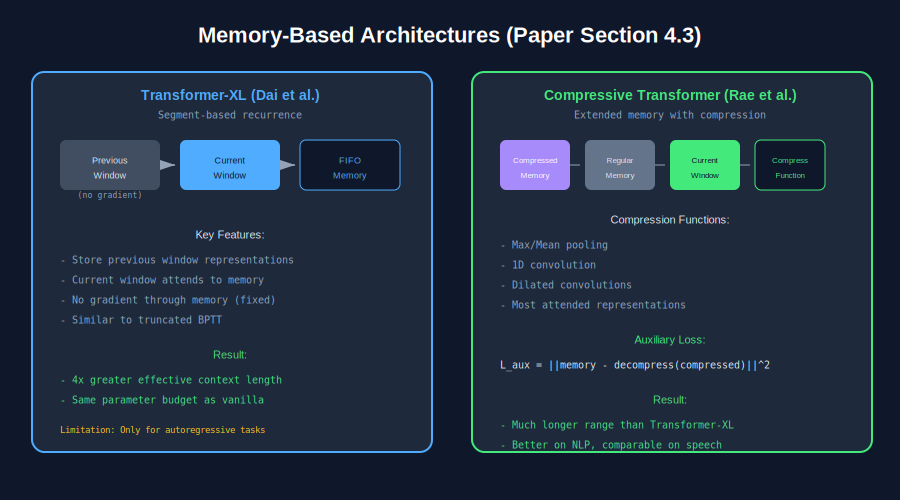
</p>

**Transformer-XL (Dai et al.):**
- Segment-based recurrence
- Store previous window in FIFO memory
- Current window attends to memory (no gradient)
- **Result**: 4× greater effective context length

**Compressive Transformer (Rae et al.):**
- Adds compressed memory layer
- Compression functions: pooling, convolution, most-attended
- **Result**: Even longer range dependencies

---

## Combining Techniques

Maximum efficiency comes from **combining multiple approaches**:

<p align="center">
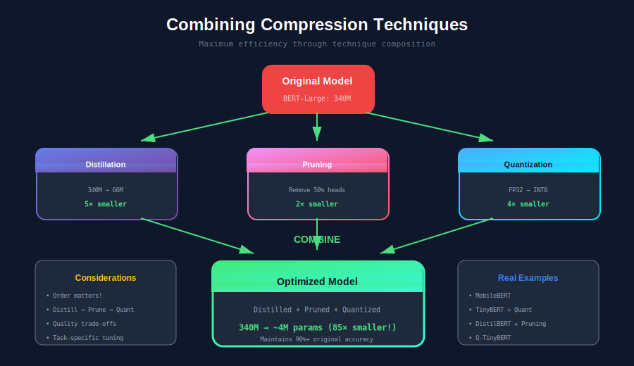
</p>

### Recommended Pipeline:

```
1. Knowledge Distillation  → 340M → 66M (5× smaller)
2. Structured Pruning      → 66M → 33M (2× smaller)  
3. INT8 Quantization       → 33M → 8M effective (4× smaller)
────────────────────────────────────────────────────────
Result: 40-85× compression, maintaining 90%+ accuracy
```

### Real-World Examples:
- MobileBERT: Distillation + Bottleneck design
- TinyBERT + Quant: Layer-wise distillation + INT8
- DistilBERT + Pruning: Task-agnostic distillation + head pruning

---

## Comprehensive Comparison

### Model Size Comparison

<p align="center">
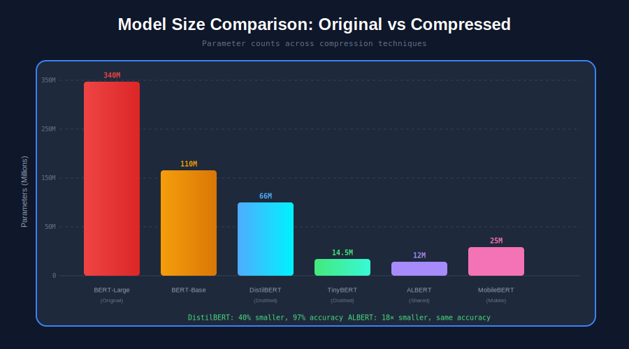
</p>

### Complexity Comparison Table

<p align="center">
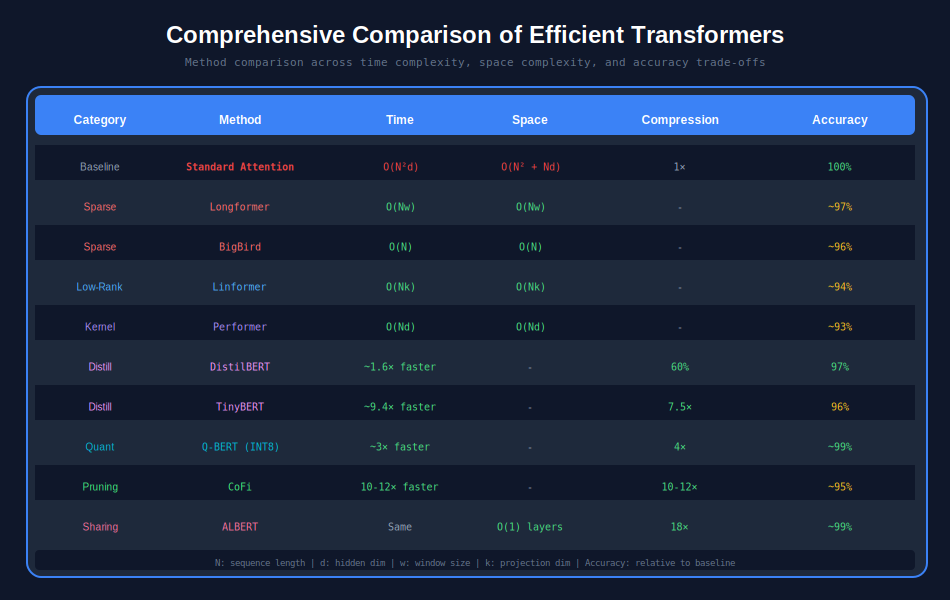
</p>

### Summary Table

| Method | Time | Space | Best For |
|--------|------|-------|----------|
| **Standard** | O(n²d) | O(n²) | Baseline |
| **Longformer** | O(n) | O(n) | Long documents |
| **BigBird** | O(n) | O(n) | Long sequences + theory |
| **Reformer** | O(n log n) | O(n log n) | Very long sequences |
| **Linformer** | O(nk) | O(nk) | Fixed-length tasks |
| **Performer** | O(npd) | O(npd) | General linear attention |
| **DistilBERT** | Same | Same | Deployment |
| **INT8 Quant** | ~3× faster | 4× smaller | Inference |
| **ALBERT** | Same | 18× smaller | Memory-constrained |

---

## Conclusion

### Key Takeaways

1. **The bottleneck is QKᵀ**: O(n²) comes from computing all pairwise attention scores

2. **Sparse patterns work**: Most attention weights are small; structured sparsity preserves performance

3. **Kernel trick enables O(n)**: Decompose softmax as φ(Q)φ(K)ᵀ and rearrange computation

4. **QK interaction may not be essential**: Synthesizers learn scores without dot products

5. **Combine methods**: Distillation + Pruning + Quantization can achieve **40-85× compression**

### Practical Recommendations

| Scenario | Recommended Approach |
|----------|---------------------|
| Long sequences (>512) | Longformer, BigBird, Performer |
| Resource-constrained deployment | DistilBERT + INT8 |
| Memory-limited training | Gradient checkpointing + Mixed precision |
| Autoregressive generation | Transformer-XL, Compressive |
| Classification tasks | Funnel-Transformer |
| Maximum compression | Distillation → Pruning → Quantization |

---

## All Visualizations Reference

| # | Figure | Description |
|---|--------|-------------|
| 1 | [Overview Taxonomy](svg_figs/overview_taxonomy.svg) | Complete method taxonomy |
| 2 | [RNN vs Transformer](svg_figs/rnn_vs_transformer.svg) | Sequential vs parallel processing |
| 3 | [Transformer Architecture](svg_figs/transformer_architecture_detailed.svg) | Encoder-decoder structure |
| 4 | [Attention Formulas](svg_figs/attention_formulas_complete.svg) | Equations 1-9 |
| 5 | [Formula Attention](svg_figs/formula_attention.svg) | Key attention equations |
| 6 | [Transformer Bottlenecks](svg_figs/transformer_bottlenecks.svg) | 4 efficiency challenges |
| 7 | [Architecture Overview](svg_figs/architecture_overview.svg) | Component analysis |
| 8 | [Efficient Attention Methods](svg_figs/efficient_attention_methods.svg) | Sparse/Low-rank/Kernel |
| 9 | [General Methods Formulas](svg_figs/general_methods_formulas.svg) | All general techniques |
| 10 | [Gradient Checkpointing](svg_figs/gradient_checkpointing.svg) | Memory-compute trade-off |
| 11 | [Knowledge Distillation](svg_figs/knowledge_distillation.svg) | Teacher-student diagram |
| 12 | [Formula Distillation](svg_figs/formula_distillation.svg) | KD loss equations |
| 13 | [Quantization Methods](svg_figs/quantization_methods.svg) | PTQ vs QAT |
| 14 | [Formula Quantization](svg_figs/formula_quantization.svg) | Quantization equations |
| 15 | [Pruning Methods](svg_figs/pruning_methods.svg) | Structured vs unstructured |
| 16 | [Formula Pruning](svg_figs/formula_pruning.svg) | Pruning criteria |
| 17 | [Weight Sharing](svg_figs/weight_sharing.svg) | ALBERT, LoRA |
| 18 | [Mixture of Experts](svg_figs/mixture_of_experts.svg) | Switch Transformer/MoE |
| 19 | [Micro-Batching GPipe](svg_figs/micro_batching_gpipe.svg) | Pipeline parallelism |
| 20 | [Sparse Attention Patterns](svg_figs/sparse_attention_patterns.svg) | Pattern visualization |
| 21 | [Sparse Attention Detailed](svg_figs/sparse_attention_detailed.svg) | All sparse methods |
| 22 | [Linformer Formula](svg_figs/linformer_formula.svg) | Low-rank factorization |
| 23 | [Synthesizer Formulas](svg_figs/synthesizer_nystrom_formulas.svg) | Synthesizer/Nyström |
| 24 | [Linear Attention](svg_figs/linear_attention.svg) | Kernel-based attention |
| 25 | [Performer Kernel](svg_figs/performer_kernel_formula.svg) | FAVOR+ algorithm |
| 26 | [Memory Architecture](svg_figs/memory_architecture.svg) | Transformer-XL/Compressive |
| 27 | [Combined Approach](svg_figs/combined_approach.svg) | Technique composition |
| 28 | [Model Size Comparison](svg_figs/model_size_comparison.svg) | Size chart |
| 29 | [Complexity Table](svg_figs/complexity_comparison_table.svg) | Method comparison |

---

## 📚 References

This study guide is based on:

> **A Practical Survey on Faster and Lighter Transformers**  
> Fournier, Quentin; Caron, Gaétan Marceau; Aloise, Daniel  
> ACM Computing Surveys, 2023

---

<p align="center">
  <b>⚡ Making Transformers Practical for Real-World Deployment ⚡</b>
  <br><br>
  <i>From O(n²) to O(n) — The Journey to Efficient AI</i>
</p>
