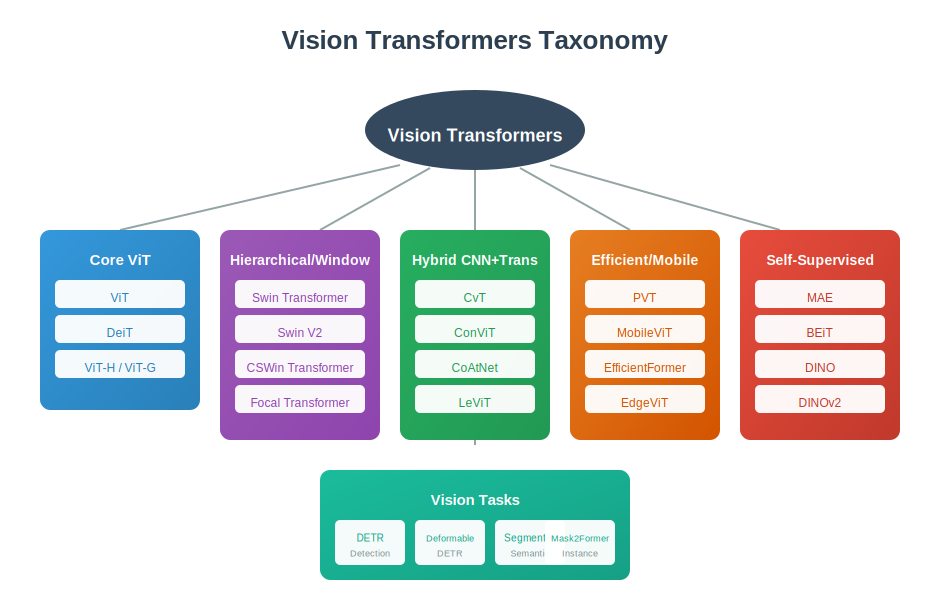
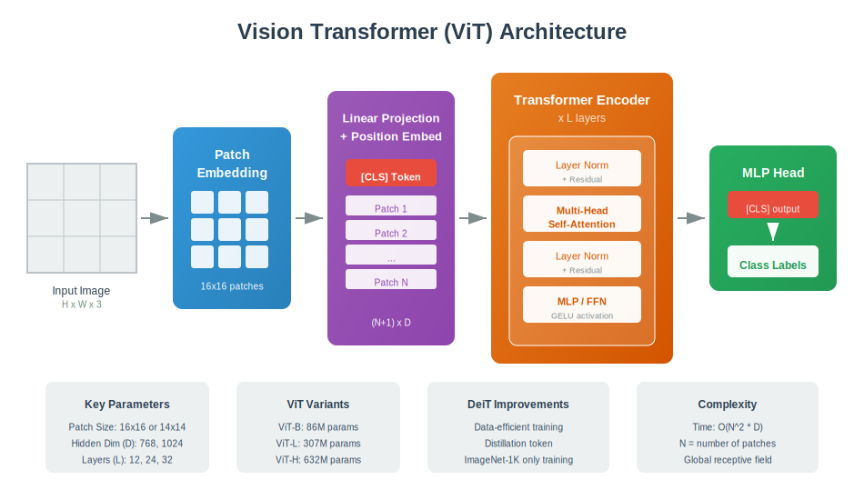
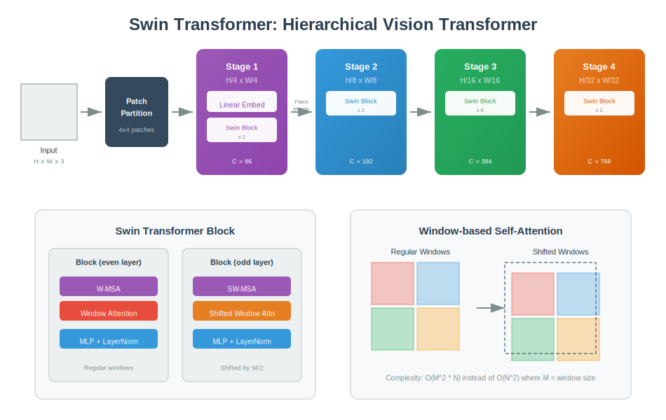
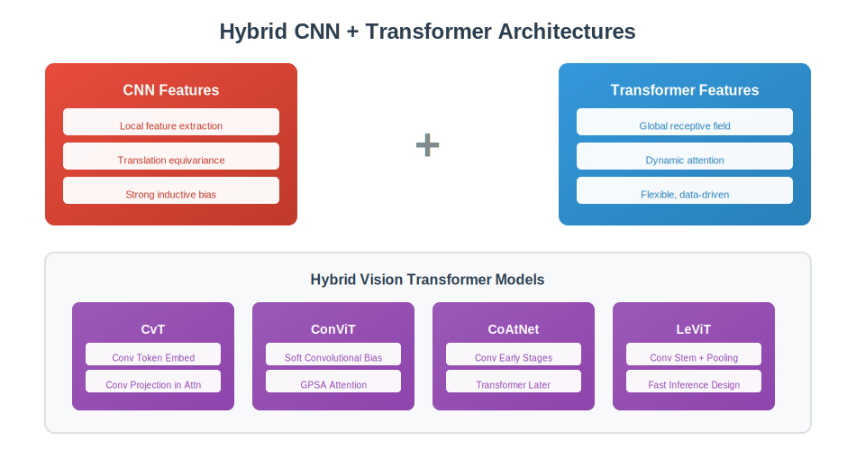
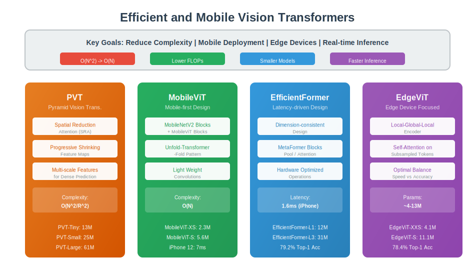
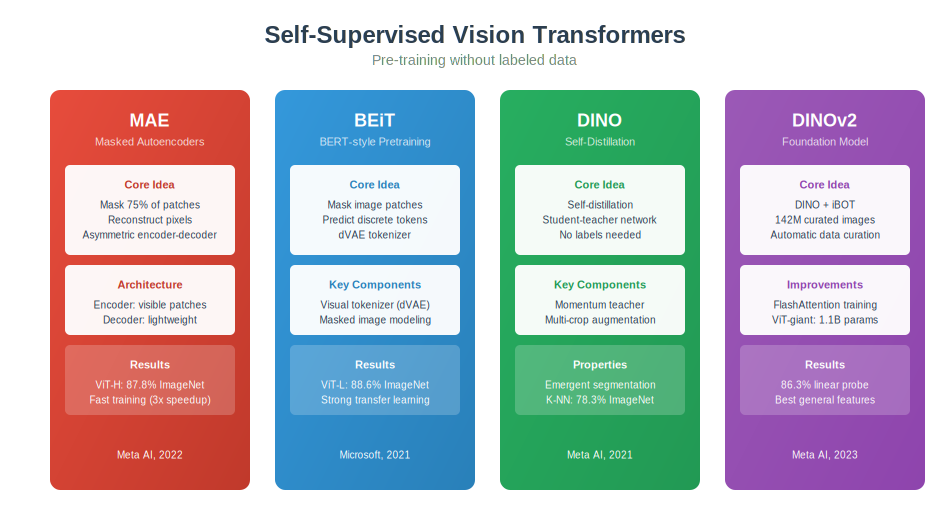
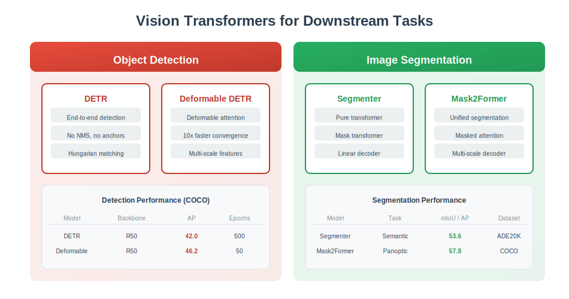

<div align="center">

# 👁️ The Complete Visual Guide to Vision Transformers

### *From ViT to Foundation Models: Understanding Visual Attention*

---

*A comprehensive journey through Vision Transformer architectures*  
*Classification • Detection • Segmentation • Self-Supervised Learning*

</div>

---

## 📖 Table of Contents

- [Introduction](#-introduction)
- [Vision Transformers Taxonomy](#-vision-transformers-taxonomy)
- [Core ViT Architecture](#-core-vit-architecture)
- [Interview Q&A (130+ Questions)](#-interview-questions--answers)
  - [ViT](#vit)
  - [DeiT](#deit)
  - [ViT Variants](#vit-variants)
- [Hierarchical Vision Transformers](#-hierarchical-vision-transformers)
  - [Swin Transformer](#swin-transformer)
  - [Swin V2](#swin-v2)
  - [Other Hierarchical Models](#other-hierarchical-models)
- [Hybrid CNN + Transformer](#-hybrid-cnn--transformer)
  - [CvT, ConViT, CoAtNet, LeViT](#hybrid-models)
- [Efficient and Mobile ViT](#-efficient-and-mobile-vit)
  - [PVT](#pvt)
  - [MobileViT](#mobilevit)
  - [EfficientFormer](#efficientformer)
  - [EdgeViT](#edgevit)
- [Self-Supervised Vision Transformers](#-self-supervised-vision-transformers)
  - [MAE](#mae)
  - [BEiT](#beit)
  - [DINO and DINOv2](#dino-and-dinov2)
- [Vision Tasks](#-vision-tasks)
  - [Object Detection: DETR](#object-detection-detr)
  - [Segmentation: Mask2Former](#segmentation-mask2former)
- [Model Comparison](#-model-comparison)
- [All Visualizations](#-all-visualizations)

---

## 🌟 Introduction

Vision Transformers (ViT) have revolutionized computer vision by applying the transformer architecture, originally designed for NLP, to image understanding. This guide covers:

- **Core ViT**: The original vision transformer and its improvements
- **Hierarchical**: Multi-scale feature extraction (Swin, CSWin)
- **Hybrid**: Combining CNN and Transformer strengths
- **Efficient**: Mobile and edge deployment
- **Self-Supervised**: Pre-training without labels (MAE, DINO)
- **Tasks**: Detection, segmentation, and beyond

---

## 🗺️ Vision Transformers Taxonomy

<div align="center">

</div>

### At a Glance

| Category | Key Models | Focus |
|----------|------------|-------|
| **Core ViT** | ViT, DeiT, ViT-H/G | Pure transformer for images |
| **Hierarchical** | Swin, CSWin, Focal | Multi-scale features |
| **Hybrid** | CvT, CoAtNet, LeViT | CNN + Transformer fusion |
| **Efficient** | PVT, MobileViT, EdgeViT | Mobile deployment |
| **Self-Supervised** | MAE, BEiT, DINO/v2 | Pre-training without labels |
| **Tasks** | DETR, Mask2Former | Detection & Segmentation |

---

## 🔷 Core ViT Architecture

<div align="center">

</div>

### ViT

The original **Vision Transformer** (Dosovitskiy et al., 2020) treats an image as a sequence of patches:

| Step | Description |
|------|-------------|
| 1. Patch Embedding | Split image into 16×16 patches |
| 2. Linear Projection | Project each patch to dimension D |
| 3. Position Embedding | Add learnable position encodings |
| 4. [CLS] Token | Prepend classification token |
| 5. Transformer Encoder | Apply L transformer layers |
| 6. MLP Head | Classify using [CLS] output |

**Key Formula:**
```
z₀ = [x_class; x¹_p E; x²_p E; ...; xᴺ_p E] + E_pos
```

### DeiT

**Data-efficient Image Transformers** improves ViT training:

| Innovation | Description |
|------------|-------------|
| **Distillation Token** | Learn from CNN teacher |
| **Data Augmentation** | RandAugment, Mixup, CutMix |
| **Regularization** | Stochastic depth, repeated augmentation |
| **Training** | ImageNet-1K only (no JFT-300M) |

### ViT Variants

| Model | Parameters | ImageNet Top-1 | Notes |
|-------|------------|----------------|-------|
| ViT-B/16 | 86M | 77.9% | Base model |
| ViT-L/16 | 307M | 79.7% | Large model |
| ViT-H/14 | 632M | 88.6% | Huge model |
| ViT-G/14 | 1.8B | 90.4% | Giant (JFT) |

---

## 🏗️ Hierarchical Vision Transformers

<div align="center">

</div>

### Swin Transformer

**Shifted Window Transformer** (Liu et al., 2021) introduces:

#### Key Innovations

| Feature | Description | Benefit |
|---------|-------------|---------|
| **Hierarchical Structure** | 4 stages with downsampling | Multi-scale features |
| **Window Attention** | Attention within local windows | O(N) complexity |
| **Shifted Windows** | Alternate regular/shifted windows | Cross-window connections |
| **Patch Merging** | Reduce spatial resolution progressively | FPN-like structure |

#### Complexity Comparison

| Method | Complexity | Notes |
|--------|------------|-------|
| ViT (Global) | O(N²) | N = number of patches |
| Swin (Window) | O(M² × N) | M = window size (7) |

#### Swin Variants

| Model | Params | ImageNet | FLOPs |
|-------|--------|----------|-------|
| Swin-T | 29M | 81.3% | 4.5G |
| Swin-S | 50M | 83.0% | 8.7G |
| Swin-B | 88M | 83.5% | 15.4G |
| Swin-L | 197M | 87.3% | 34.5G |

### Swin V2

Improvements for scaling:
- **Residual post-norm** for training stability
- **Scaled cosine attention** replaces dot product
- **Log-spaced CPB** for position encoding
- Supports up to 3 billion parameters

### Other Hierarchical Models

| Model | Key Innovation |
|-------|----------------|
| **CSWin** | Cross-shaped window attention |
| **Focal** | Multi-scale focal attention |
| **Twins** | Alternating local-global attention |

---

## 🔀 Hybrid CNN + Transformer

<div align="center">

</div>

### Hybrid Models

Combining the best of both worlds:

| Model | CNN Component | Transformer Component | Key Benefit |
|-------|---------------|----------------------|-------------|
| **CvT** | Convolutional token embedding | Standard attention | Better token representation |
| **ConViT** | Soft convolutional bias | GPSA attention | Smooth CNN→Transformer |
| **CoAtNet** | MBConv early stages | Transformer later stages | Optimal layer mixing |
| **LeViT** | Conv stem + pooling | Efficient attention | Fast inference (5× faster) |

### Why Hybrid?

| CNN Strengths | Transformer Strengths |
|---------------|----------------------|
| Local feature extraction | Global receptive field |
| Translation equivariance | Dynamic attention |
| Strong inductive bias | Data-driven learning |
| Efficient for small data | Scales with data |

---

## 📱 Efficient and Mobile ViT

<div align="center">

</div>

### PVT

**Pyramid Vision Transformer** introduces:
- **Spatial Reduction Attention (SRA)**: Reduces K,V spatial dimensions
- **Progressive shrinking**: Multi-scale feature maps
- Complexity: O(N²/R²) where R is reduction ratio

### MobileViT

Designed for mobile devices:
- **MobileNetV2 blocks** + **MobileViT blocks**
- Unfold-Transformer-Fold pattern
- **2.3M parameters** with 78.4% ImageNet accuracy
- **7ms** on iPhone 12

### EfficientFormer

Latency-driven design:
- **MetaFormer architecture** with Pool or Attention
- Dimension-consistent design
- **1.6ms** on iPhone (CoreML)
- EfficientFormer-L1: 12M params, 79.2% accuracy

### EdgeViT

Edge device optimization:
- **Local-Global-Local** encoder
- Self-attention on subsampled tokens
- EdgeViT-XXS: 4.1M params
- EdgeViT-S: 78.4% with 11.1M params

### Mobile Comparison

| Model | Params | Top-1 | iPhone Latency |
|-------|--------|-------|----------------|
| MobileViT-XS | 2.3M | 74.8% | 7ms |
| EfficientFormer-L1 | 12M | 79.2% | 1.6ms |
| EdgeViT-XXS | 4.1M | 74.4% | ~3ms |

---

## 🎓 Self-Supervised Vision Transformers

<div align="center">

</div>

### MAE

**Masked Autoencoders** (He et al., 2022):

| Component | Description |
|-----------|-------------|
| **Masking** | Randomly mask 75% of patches |
| **Encoder** | Only processes visible patches (25%) |
| **Decoder** | Lightweight, reconstructs pixels |
| **Pretext Task** | Pixel reconstruction |

**Key Result**: ViT-H achieves 87.8% on ImageNet with faster training (3× speedup)

### BEiT

**BERT Pre-training for Image Transformers** (Bao et al., 2021):

- Uses **discrete visual tokenizer (dVAE)**
- Predicts visual tokens instead of pixels
- ViT-L: 88.6% ImageNet accuracy
- Strong transfer to downstream tasks

### DINO and DINOv2

**Self-Distillation with No Labels**:

| Version | Key Features |
|---------|--------------|
| **DINO** | Student-teacher self-distillation, emergent segmentation |
| **DINOv2** | 142M curated images, ViT-giant (1.1B params), 86.3% linear probe |

DINOv2 is considered one of the best vision **foundation models**.

---

## 🎯 Vision Tasks

<div align="center">

</div>

### Object Detection: DETR

**DEtection TRansformer** (Carion et al., 2020):

| Feature | Description |
|---------|-------------|
| **End-to-end** | No NMS, no anchors |
| **Set prediction** | Hungarian matching |
| **Object queries** | Learnable queries (100) |
| **Architecture** | CNN backbone + Transformer encoder-decoder |

**Deformable DETR** improvements:
- Deformable attention (sparse)
- 10× faster convergence
- Multi-scale features
- 46.2 AP on COCO (vs 42.0 for DETR)

### Segmentation: Mask2Former

**Universal Segmentation** (Cheng et al., 2022):

| Task | Supported |
|------|-----------|
| **Semantic** | Per-pixel classification |
| **Instance** | Object-wise segmentation |
| **Panoptic** | Unified semantic + instance |

Key features:
- Masked attention for efficiency
- Multi-scale deformable attention
- 57.8 PQ on COCO panoptic

---

## 📊 Model Comparison

### Classification Performance (ImageNet-1K)

| Model | Params | Top-1 | FLOPs | Notes |
|-------|--------|-------|-------|-------|
| ViT-B/16 | 86M | 77.9% | 17.6G | Baseline |
| DeiT-B | 86M | 81.8% | 17.6G | Better training |
| Swin-B | 88M | 83.5% | 15.4G | Hierarchical |
| CoAtNet-3 | 168M | 84.5% | 34.7G | Hybrid |
| MAE ViT-H | 632M | 87.8% | - | Self-supervised |
| DINOv2-g | 1.1B | 86.3% | - | Linear probe |

### Efficiency Comparison

| Model | Focus | Best For |
|-------|-------|----------|
| **ViT** | Simplicity | Research baseline |
| **Swin** | Multi-scale | Dense prediction |
| **MobileViT** | Mobile | Edge devices |
| **EfficientFormer** | Speed | Real-time |
| **MAE/DINO** | Pre-training | Foundation models |

---

## 🎯 Interview Questions & Answers

<table>
<tr>
<td width="70%">

### 📚 [130+ Interview Questions with Answers](./interview_qa/README.md)

Comprehensive interview preparation covering:

| Section | Topics | Questions |
|---------|--------|-----------|
| **Fundamentals** | ViT basics, comparison with CNN | Q1-25 |
| **Patch & Position** | Embedding, encoding types | Q26-40 |
| **Attention** | Multi-head, complexity, patterns | Q41-55 |
| **Training** | Optimization, DeiT, recipes | Q56-70 |
| **Swin/Hierarchical** | Window attention, variants | Q71-85 |
| **Efficient/Hybrid** | Mobile, Edge, hybrid models | Q86-100 |
| **Self-Supervised** | MAE, BEiT, DINO | Q101-115 |
| **Vision Tasks** | Detection, Segmentation | Q116-130 |

</td>
<td width="30%">

**9 Diagrams**
- Patch embedding process
- [CLS] token explained
- ViT vs CNN comparison
- Position encoding types
- Attention complexity
- Window vs Global attention
- Multi-head attention
- MAE pre-training
- DeiT distillation

</td>
</tr>
</table>

📄 [**Start Interview Prep →**](./interview_qa/README.md)

---

## 📁 All Visualizations

All diagrams are available in the `svg_figs/` folder:

| File | Description |
|------|-------------|
| `vit_taxonomy.svg` | Complete taxonomy of Vision Transformers |
| `core_vit_architecture.svg` | ViT architecture with all components |
| `swin_transformer.svg` | Swin Transformer hierarchical design |
| `hybrid_cnn_transformer.svg` | CNN + Transformer hybrid models |
| `efficient_mobile_vit.svg` | Mobile and efficient variants |
| `self_supervised_vit.svg` | MAE, BEiT, DINO pre-training |
| `vision_tasks.svg` | Detection and segmentation models |

---

## 📚 Key Papers

| Model | Paper | Year |
|-------|-------|------|
| ViT | "An Image is Worth 16x16 Words" | 2020 |
| DeiT | "Training data-efficient image transformers" | 2021 |
| Swin | "Swin Transformer: Hierarchical Vision Transformer" | 2021 |
| MAE | "Masked Autoencoders Are Scalable Vision Learners" | 2022 |
| DINOv2 | "DINOv2: Learning Robust Visual Features" | 2023 |
| DETR | "End-to-End Object Detection with Transformers" | 2020 |
| Mask2Former | "Masked-attention Mask Transformer" | 2022 |

---


