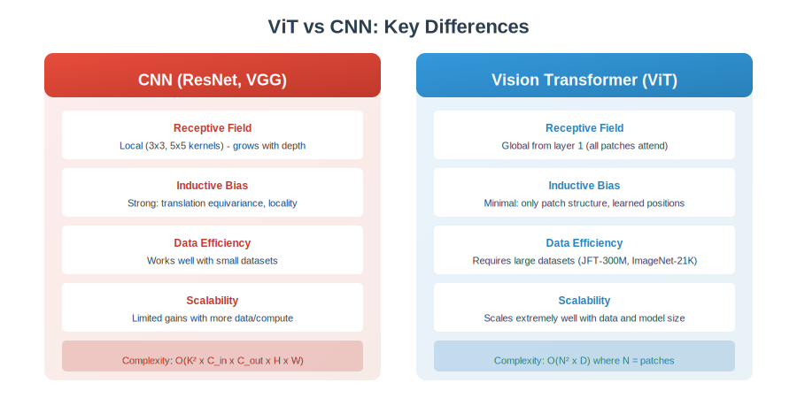
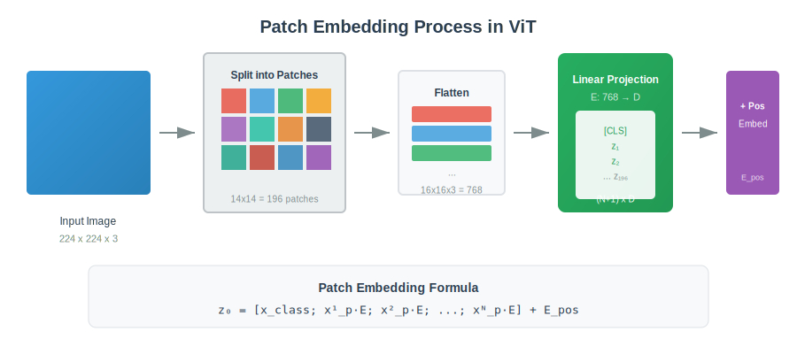
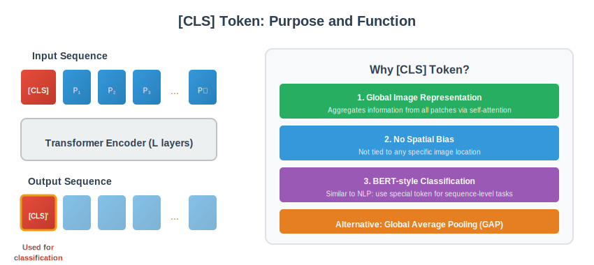
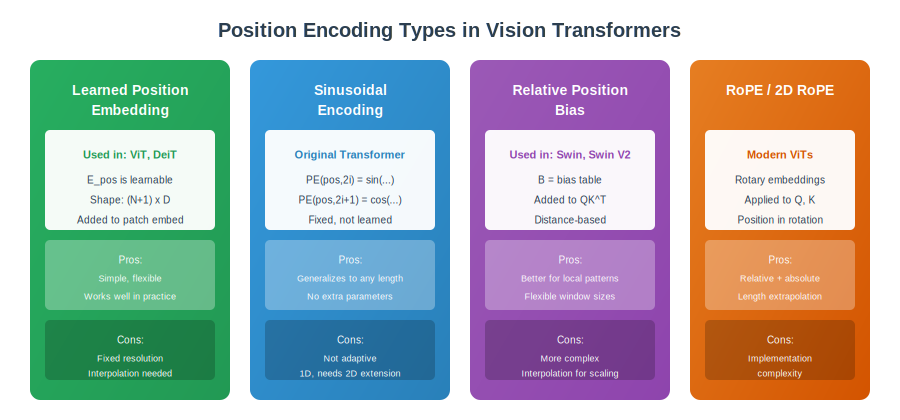
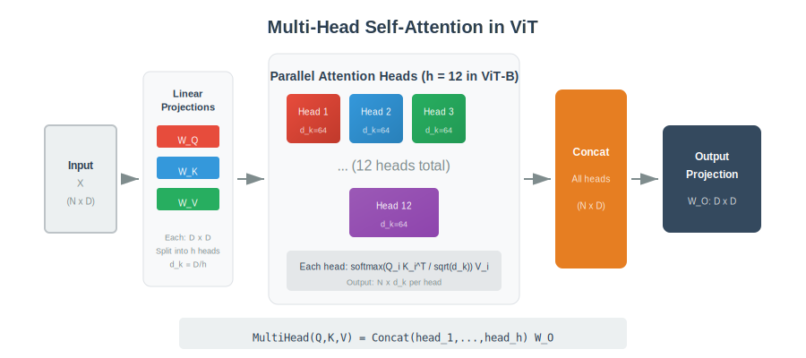
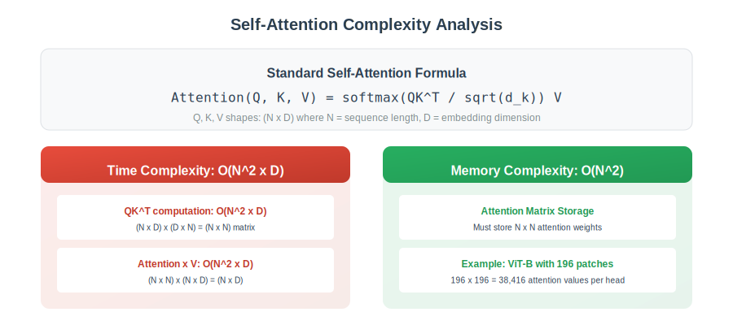
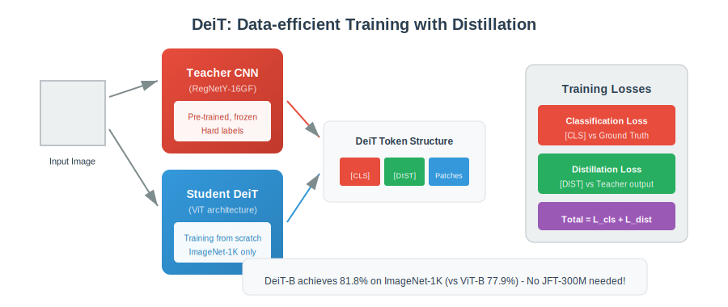
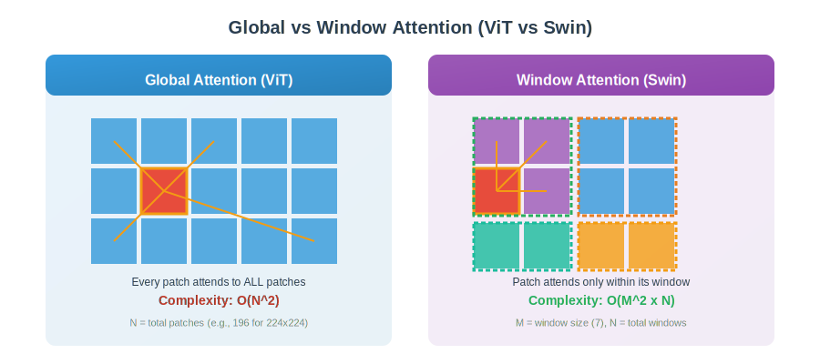
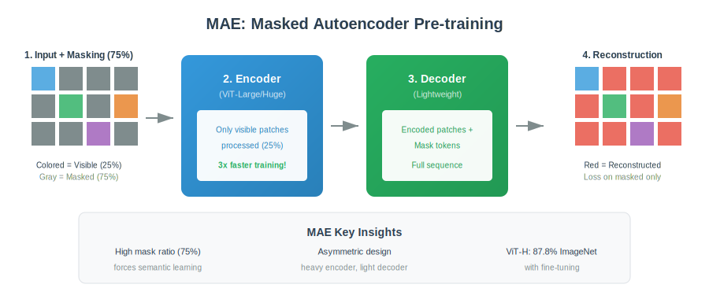

<div align="center">

# 🎯 Vision Transformers Interview Questions & Answers

### *100+ Questions to Master Vision Transformers for Technical Interviews*

---

*Comprehensive coverage from fundamentals to advanced topics*  
*With visual explanations for complex concepts*

</div>

---

## 📖 Table of Contents

- [Section 1: ViT Fundamentals (Q1-25)](#section-1-vit-fundamentals)
- [Section 2: Patch Embedding & Position Encoding (Q26-40)](#section-2-patch-embedding--position-encoding)
- [Section 3: Attention Mechanism (Q41-55)](#section-3-attention-mechanism)
- [Section 4: ViT Training & Optimization (Q56-70)](#section-4-vit-training--optimization)
- [Section 5: Hierarchical ViT - Swin (Q71-85)](#section-5-hierarchical-vit---swin-transformer)
- [Section 6: Hybrid & Efficient Models (Q86-100)](#section-6-hybrid--efficient-models)
- [Section 7: Self-Supervised Learning (Q101-115)](#section-7-self-supervised-learning)
- [Section 8: Vision Tasks - Detection & Segmentation (Q116-130)](#section-8-vision-tasks---detection--segmentation)
- [All Visualizations](#-all-visualizations)

---

## Section 1: ViT Fundamentals

<div align="center">

</div>

### Q1: What is a Vision Transformer (ViT)?

**Answer:** Vision Transformer is a model that applies the transformer architecture, originally designed for NLP, to image classification. Instead of processing images with convolutions, ViT:
- Splits the image into fixed-size patches (e.g., 16×16)
- Linearly embeds each patch
- Adds position embeddings
- Processes the sequence through standard transformer encoder layers
- Uses a special [CLS] token for classification

Key paper: "An Image is Worth 16x16 Words" (Dosovitskiy et al., 2020)

---

### Q2: How does ViT differ from CNN architectures?

**Answer:**

| Aspect | CNN | ViT |
|--------|-----|-----|
| **Receptive Field** | Local, grows with depth | Global from layer 1 |
| **Inductive Bias** | Strong (locality, translation equivariance) | Minimal |
| **Data Efficiency** | Works with small datasets | Needs large datasets |
| **Scalability** | Limited gains | Scales well with data/compute |
| **Architecture** | Convolutional layers | Self-attention layers |

---

### Q3: Why does ViT need more data than CNNs?

**Answer:** ViT lacks the strong inductive biases of CNNs:
- **No built-in locality**: CNNs assume nearby pixels are related (via small kernels)
- **No translation equivariance**: CNNs naturally share weights across positions
- **No hierarchical structure**: CNNs build features from simple to complex

ViT must learn these patterns from data, requiring ~14M+ images (ImageNet-21K) or ~300M (JFT-300M) to match CNN performance on ImageNet-1K.

---

### Q4: What is the input format for ViT?

**Answer:** For an image of size H × W × C:
1. Split into N patches of size P × P
2. N = (H × W) / P² (e.g., 224²/16² = 196 patches)
3. Flatten each patch: P × P × C = 768 for P=16, C=3
4. Linear projection to dimension D (hidden size)
5. Add [CLS] token → sequence of (N+1) tokens

---

### Q5: What are the main ViT variants and their sizes?

**Answer:**

| Model | Layers | Hidden (D) | Heads | Params | ImageNet |
|-------|--------|------------|-------|--------|----------|
| ViT-B/16 | 12 | 768 | 12 | 86M | 77.9% |
| ViT-L/16 | 24 | 1024 | 16 | 307M | 79.7% |
| ViT-H/14 | 32 | 1280 | 16 | 632M | 88.6% |
| ViT-G/14 | 48 | 1664 | 16 | 1.8B | 90.4% |

The notation "B/16" means Base model with 16×16 patches.

---

### Q6: What does the "/16" or "/14" mean in ViT-B/16?

**Answer:** It indicates the patch size:
- **/16**: 16×16 pixel patches
- **/14**: 14×14 pixel patches

Smaller patches = more tokens = higher computation but potentially better performance. For 224×224 images:
- /16 → 196 patches
- /14 → 256 patches

---

### Q7: What is the computational complexity of ViT?

**Answer:** O(N² × D) where:
- N = number of patches
- D = hidden dimension

The quadratic complexity comes from self-attention computing all pairwise relationships between N tokens. This limits ViT to relatively small image sizes (224×224 typical).

---

### Q8: How does ViT handle different image resolutions?

**Answer:** ViT uses learned position embeddings for a fixed number of patches. For different resolutions:
1. Keep patch size constant (e.g., 16×16)
2. Number of patches changes
3. **Interpolate position embeddings** using 2D interpolation
4. Fine-tune on new resolution

This works but may lose performance - position embeddings don't generalize perfectly.

---

### Q9: Why is ViT competitive with CNNs despite lacking inductive biases?

**Answer:** When trained on sufficient data:
1. **Global attention** can learn to focus on relevant image regions
2. **Scalability**: Performance improves with more data/parameters
3. **Flexibility**: Can learn arbitrary patterns, not just local ones
4. **Pre-training**: Large-scale pre-training enables strong transfer

At ImageNet scale alone, CNNs win. At JFT-300M scale, ViT wins.

---

### Q10: What is the feed-forward network (FFN/MLP) in ViT?

**Answer:** After each self-attention layer, ViT applies a 2-layer MLP:

```
FFN(x) = GELU(xW₁ + b₁)W₂ + b₂
```

- First layer expands dimension: D → 4D
- GELU activation (smoother than ReLU)
- Second layer projects back: 4D → D
- Applied to each token independently

---

### Q11: What normalization does ViT use and where?

**Answer:** ViT uses **Layer Normalization** (not BatchNorm):
- Applied **before** each attention and FFN block (Pre-LN)
- Original transformer used Post-LN, but Pre-LN is more stable
- LayerNorm normalizes across features, not batch

```
x = x + Attention(LayerNorm(x))
x = x + FFN(LayerNorm(x))
```

---

### Q12: What is the difference between Pre-LN and Post-LN?

**Answer:**

| Pre-LN (ViT uses) | Post-LN (Original) |
|-------------------|-------------------|
| `x + Attn(LN(x))` | `LN(x + Attn(x))` |
| More stable training | Can have gradient issues |
| No warmup needed | Often needs warmup |
| Used in GPT-2+, ViT | Original Transformer |

Pre-LN places layer norm before the sublayer, making gradients more stable.

---

### Q13: How many parameters does each component of ViT have?

**Answer:** For ViT-B (D=768, 12 layers, 12 heads):

| Component | Parameters |
|-----------|------------|
| Patch Embedding | 768 × 768 = 590K |
| Position Embedding | 197 × 768 = 151K |
| Per Attention Layer | ~2.4M (Q,K,V,O projections) |
| Per FFN Layer | ~4.7M (2 linear layers) |
| Total 12 layers | ~85M |
| Classification Head | 768 × 1000 = 768K |

---

### Q14: What dropout is used in ViT?

**Answer:** ViT applies dropout in multiple places:
- **Attention dropout**: After softmax, before multiplying with V
- **Projection dropout**: After attention output projection
- **FFN dropout**: After FFN
- **Embedding dropout**: After adding position embeddings (sometimes)

Typical rate: 0.1 during training.

---

### Q15: What is the role of the MLP expansion ratio in ViT?

**Answer:** The FFN/MLP expands then contracts the dimension:
- Input: D → Hidden: 4D → Output: D
- Expansion ratio = 4 is standard

This allows the model to:
1. Project to higher-dimensional space
2. Apply non-linearity (GELU)
3. Learn complex token-wise transformations
4. Project back to original dimension

---

### Q16: How does ViT's global receptive field affect learning?

**Answer:** Global receptive field from layer 1 means:

**Advantages:**
- Can capture long-range dependencies immediately
- No information bottleneck from pooling
- More flexible pattern learning

**Disadvantages:**
- Must learn local patterns that CNNs get for free
- Harder to learn with less data
- Quadratic complexity limits resolution

---

### Q17: What activation function does ViT use?

**Answer:** **GELU** (Gaussian Error Linear Unit):

```
GELU(x) = x × Φ(x)
```

where Φ(x) is the CDF of standard normal distribution.

Approximation: `GELU(x) ≈ 0.5x(1 + tanh(√(2/π)(x + 0.044715x³)))`

GELU is smoother than ReLU and works better for transformers.

---

### Q18: How is ViT typically pre-trained and fine-tuned?

**Answer:**

**Pre-training:**
- Large dataset (ImageNet-21K, JFT-300M)
- Image classification task
- High resolution (224×224 or 384×384)
- Long training (300 epochs+)

**Fine-tuning:**
- Target dataset (e.g., ImageNet-1K)
- Often higher resolution (384×384 or 512×512)
- Interpolate position embeddings
- Shorter training (20-50 epochs)
- Lower learning rate

---

### Q19: What is "fine-tuning at higher resolution"?

**Answer:** A technique to improve ViT performance:
1. Pre-train at 224×224
2. Fine-tune at 384×384 or higher
3. Interpolate position embeddings for more patches

Benefits:
- More patches = more tokens = finer detail
- Leverages pre-trained weights
- Significant accuracy boost (1-2%)

---

### Q20: How does ViT compare to CNNs on small datasets?

**Answer:** On small datasets, CNNs outperform ViT:

| Dataset Size | Winner |
|--------------|--------|
| < 1M images | CNN |
| 1M - 14M | Competitive |
| 14M+ | ViT |
| 300M+ | ViT significantly better |

DeiT addressed this with better training recipes and distillation.

---

### Q21: What are the advantages of ViT over CNNs?

**Answer:**
1. **Better scaling**: Performance improves with more data/compute
2. **Unified architecture**: Same architecture for vision and language
3. **Global context**: Captures long-range dependencies
4. **Interpretability**: Attention maps show what model focuses on
5. **Flexibility**: No built-in assumptions about spatial structure

---

### Q22: What are the disadvantages of ViT?

**Answer:**
1. **Data hungry**: Needs large pre-training data
2. **Quadratic complexity**: O(N²) limits high resolution
3. **No multi-scale features**: Unlike CNNs with FPN
4. **Position embedding interpolation**: Resolution changes need care
5. **Training instability**: Requires careful hyperparameters

---

### Q23: How does batch size affect ViT training?

**Answer:** ViT is trained with large batch sizes:
- Typical: 1024-4096
- Uses learning rate warmup
- Linear LR scaling rule: LR ∝ batch_size

Large batches:
- More stable gradients
- Better GPU utilization
- Requires LR adjustment

---

### Q24: What is stochastic depth in ViT?

**Answer:** A regularization technique where layers are randomly dropped during training:
- Each layer has survival probability p
- Probability decreases with depth (early layers more important)
- At inference, use all layers with scaled outputs
- Similar to dropout but at layer level

Used in DeiT and later ViT variants for better regularization.

---

### Q25: What data augmentation is used for ViT?

**Answer:**
- **RandAugment**: Random augmentation policies
- **Mixup**: Blend two images and labels
- **CutMix**: Cut and paste regions between images
- **Random Erasing**: Randomly mask image regions
- **Color jitter**: Brightness, contrast, saturation
- **Auto Augment**: Learned augmentation policies

DeiT showed strong augmentation is crucial for data efficiency.

---

## Section 2: Patch Embedding & Position Encoding

<div align="center">

</div>

### Q26: How does patch embedding work in ViT?

**Answer:** Patch embedding converts image patches to vectors:

1. **Split**: Divide H×W×C image into N patches of P×P×C
2. **Flatten**: Each patch becomes P²C vector (e.g., 16×16×3 = 768)
3. **Linear Project**: Multiply by learnable matrix E (P²C × D)
4. **Result**: N vectors of dimension D

Equivalent to a 2D convolution with kernel=stride=P.

---

### Q27: Why is patch embedding equivalent to convolution?

**Answer:** The linear projection can be implemented as:
```python
# Method 1: Flatten + Linear
patches = image.reshape(B, N, P*P*C)
embeddings = linear(patches)  # (P²C) × D

# Method 2: Conv2d (equivalent)
embeddings = conv2d(image, kernel_size=P, stride=P)  # C → D
```

Both produce the same result - Conv2d is often used for efficiency.

---

### Q28: What is the [CLS] token and why is it used?

<div align="center">

</div>

**Answer:** [CLS] is a learnable token prepended to patch embeddings:
- Initialized randomly, learned during training
- Attends to all patches through self-attention
- Its final representation is used for classification
- Has no spatial bias (not tied to any image region)

Alternative: Global Average Pooling (GAP) of all patch tokens.

---

### Q29: What are the alternatives to using [CLS] token?

**Answer:**
1. **Global Average Pooling (GAP)**: Average all patch embeddings
2. **Global Max Pooling**: Max over patches
3. **Attention Pooling**: Learnable weighted average
4. **Class Attention**: Cross-attention with class query (CaiT)

Recent work shows GAP often works as well as [CLS].

---

### Q30: What types of position encoding exist for ViT?

<div align="center">

</div>

**Answer:**

| Type | Description | Used in |
|------|-------------|---------|
| **Learned 1D** | Learnable vectors for each position | ViT, DeiT |
| **Sinusoidal** | Fixed sine/cosine patterns | Original Transformer |
| **Relative** | Distance-based bias in attention | Swin, Swin V2 |
| **2D Learned** | Separate x,y embeddings | Some variants |
| **RoPE** | Rotary position embedding | Modern ViTs |
| **No position** | Rely on patch content | Some experiments |

---

### Q31: How do learned position embeddings work?

**Answer:**
- Initialize randomly: E_pos of shape (N+1) × D
- Add to patch embeddings: z = patch_embed + E_pos
- Learned during training via backpropagation
- Capture position information implicitly

Visualization shows learned embeddings have spatial structure!

---

### Q32: How are position embeddings interpolated for different resolutions?

**Answer:**
```python
# Original: 14×14 grid for 224×224 image
pos_embed = model.pos_embed  # (196+1, D)

# New: 24×24 grid for 384×384 image
pos_embed_2d = pos_embed[1:].reshape(14, 14, D)
pos_embed_new = F.interpolate(
    pos_embed_2d.permute(2,0,1).unsqueeze(0),
    size=(24, 24),
    mode='bicubic'
)
# Reshape back and add [CLS] embedding
```

Bicubic interpolation preserves smoothness.

---

### Q33: Why not use sinusoidal position encoding for ViT?

**Answer:** Experiments show learned embeddings work slightly better:
- Can adapt to specific patch patterns
- Learn task-relevant positional information
- Not limited to predefined frequency patterns

Sinusoidal would enable arbitrary sequence lengths but isn't commonly used in vision.

---

### Q34: What is 2D-aware position encoding?

**Answer:** Encodes row and column separately:
```python
# Standard 1D: pos 0, 1, 2, ... for flattened patches
# 2D-aware: (row, col) = (0,0), (0,1), (0,2), ...

row_embed = pos_row_embed[row_indices]  # (H/P) positions
col_embed = pos_col_embed[col_indices]  # (W/P) positions
pos_embed = row_embed + col_embed
```

Can generalize better to different aspect ratios.

---

### Q35: What is relative position encoding in Swin Transformer?

**Answer:** Instead of absolute positions, encode relative positions between tokens:
- Bias table B of size (2M-1) × (2M-1) for window size M
- Add to attention: `Attention = softmax(QK^T/√d + B)`
- Same relative position → same bias
- Better for local patterns and scaling

---

### Q36: What is Continuous Relative Position Bias (CPB)?

**Answer:** Used in Swin V2:
- MLP predicts bias from relative coordinates
- Uses log-space coordinates for larger ranges
- Enables transfer across window sizes
- Better scaling to high resolutions

---

### Q37: Does position encoding order matter?

**Answer:** For 1D learned embeddings, patches are typically ordered:
- Row-major (left-to-right, top-to-bottom)
- Position 0 = [CLS]
- Position 1 = top-left patch
- Position N = bottom-right patch

Order is arbitrary but must be consistent between training and inference.

---

### Q38: What happens without position encoding?

**Answer:** Experiments show:
- Performance drops significantly (1-2%)
- Model can still learn from patch content
- Loses ability to use spatial relationships
- Some tasks (texture classification) less affected

Position encoding is important but not absolutely necessary.

---

### Q39: How do position embeddings interact with patch embeddings?

**Answer:**
```python
z_0 = patch_embed + pos_embed  # Simple addition
```

- Same dimension (D)
- Added element-wise
- Both learned during training
- Combined information flows through transformer

Some variants use concatenation or gating instead.

---

### Q40: What is RoPE (Rotary Position Embedding) for Vision?

**Answer:** Applies rotation to query and key vectors based on position:
- Encodes position in the rotation angle
- Relative position preserved in dot product
- Better length extrapolation than learned embeddings
- Used in modern LLMs (LLaMA) and some ViTs

For 2D vision: separate rotations for x and y coordinates.

---

## Section 3: Attention Mechanism

<div align="center">

</div>

### Q41: How does self-attention work in ViT?

**Answer:**
```python
Q = X @ W_Q  # Query: (N, D)
K = X @ W_K  # Key: (N, D)
V = X @ W_V  # Value: (N, D)

# Attention computation
scores = Q @ K.T / sqrt(d_k)  # (N, N)
attention = softmax(scores)    # (N, N)
output = attention @ V         # (N, D)
```

Each patch attends to all patches, weighted by similarity.

---

### Q42: What is the complexity of self-attention?

<div align="center">

</div>

**Answer:**
- **Time**: O(N² × D) for N patches, dimension D
- **Memory**: O(N²) for attention matrix
- **QK^T**: (N×D) × (D×N) = N² operations
- **Attention × V**: (N×N) × (N×D) = N² × D operations

Quadratic in sequence length limits resolution.

---

### Q43: Why use multi-head attention?

**Answer:** Multiple heads allow:
1. **Different attention patterns**: Each head can focus on different aspects
2. **Parallel computation**: Heads are independent
3. **Subspace learning**: Each head works in D/h dimension
4. **Richer representations**: Combined output is more expressive

Typical: 12 heads for ViT-B (768/12 = 64 per head).

---

### Q44: How are Q, K, V computed in multi-head attention?

**Answer:**
```python
# Single head approach
Q = X @ W_Q  # (N, D) × (D, D) = (N, D)
K = X @ W_K
V = X @ W_V

# Split into h heads
Q = Q.reshape(N, h, d_k)  # d_k = D/h
K = K.reshape(N, h, d_k)
V = V.reshape(N, h, d_k)

# Compute attention per head, then concatenate
```

Equivalent to separate projections per head.

---

### Q45: What is the attention score normalization?

**Answer:** Divide by √d_k before softmax:
```python
scores = Q @ K.T / sqrt(d_k)
```

**Why?**
- Dot products grow with dimension
- Large values make softmax saturate
- Gradients become very small
- Division stabilizes training

---

### Q46: What patterns do attention heads learn in ViT?

**Answer:** Studies show different heads learn:
- **Local patterns**: Focus on nearby patches
- **Global patterns**: Attend to distant patches
- **Semantic patterns**: Similar content regardless of position
- **Background/foreground**: Separate object from background
- **Part-based**: Different object parts

Early layers: more local. Later layers: more semantic.

---

### Q47: How can we visualize ViT attention?

**Answer:** Methods to visualize:
1. **Attention rollout**: Multiply attention matrices through layers
2. **Attention flow**: Account for residual connections
3. **Grad-CAM**: Gradient-based attribution
4. **Head-specific**: Look at individual attention heads

[CLS] token attention often highlights objects.

---

### Q48: What is attention dropout?

**Answer:** Dropout applied to attention weights:
```python
attention = softmax(scores)
attention = dropout(attention, p=0.1)  # During training
output = attention @ V
```

Regularization that prevents over-reliance on specific patterns.

---

### Q49: How does attention relate to convolution?

**Answer:** Connections:
- **Convolution**: Fixed local pattern, shared weights
- **Attention**: Learned dynamic pattern, content-dependent

Attention can simulate convolution if it learns local patterns, but:
- No weight sharing constraint
- Must learn from data
- More flexible but needs more data

---

### Q50: What is query-key normalization?

**Answer:** Normalize Q and K before computing attention:
```python
Q = LayerNorm(Q)
K = LayerNorm(K)
scores = Q @ K.T / sqrt(d_k)
```

Benefits:
- More stable training
- Prevents attention collapse
- Used in some variants for better scaling

---

### Q51: What is cosine attention?

**Answer:** Replace dot product with cosine similarity:
```python
# Standard
scores = Q @ K.T

# Cosine attention (Swin V2)
scores = cosine_similarity(Q, K) * temperature
```

Benefits:
- Bounded scores
- Better for large models
- Used in Swin V2 for scaling

---

### Q52: How does self-attention handle variable batch sizes?

**Answer:** Self-attention naturally handles batches:
```python
# X: (B, N, D) - batch of sequences
Q = X @ W_Q  # (B, N, D)
K = X @ W_K  # (B, N, D)
V = X @ W_V  # (B, N, D)

# Attention per batch element
scores = Q @ K.transpose(-2,-1)  # (B, N, N)
```

Each batch element processed independently.

---

### Q53: What is the role of softmax temperature?

**Answer:** Temperature controls attention sharpness:
```python
attention = softmax(scores / temperature)
```

- **Temperature < 1**: Sharper, more focused attention
- **Temperature > 1**: Softer, more distributed attention
- **Default = 1 (with √d_k)**: Balanced

Used in distillation and some attention variants.

---

### Q54: How is attention different in encoder vs decoder?

**Answer:**

| Encoder (ViT) | Decoder |
|---------------|---------|
| Bidirectional | Causal masking |
| Full attention matrix | Lower triangular |
| All patches visible | Can't see future |
| Used for classification | Used for generation |

ViT is encoder-only (classification). Image generation uses decoders.

---

### Q55: What is efficient attention for ViT?

**Answer:** Methods to reduce O(N²) complexity:
- **Window attention (Swin)**: O(M² × N/M²) = O(M² × num_windows)
- **Linear attention**: O(N × D²)
- **Sparse attention**: O(N × k) for k neighbors
- **FlashAttention**: Same complexity, better memory

Swin Transformer's window attention is most popular for vision.

---

## Section 4: ViT Training & Optimization

### Q56: What optimizer is typically used for ViT?

**Answer:** **AdamW** (Adam with decoupled weight decay):
```python
optimizer = AdamW(
    model.parameters(),
    lr=1e-3,
    betas=(0.9, 0.999),
    weight_decay=0.05
)
```

Weight decay applied separately from gradient update (decoupled).

---

### Q57: What learning rate schedule is used for ViT?

**Answer:** Cosine decay with warmup:
```python
# Warmup: linear increase for first N steps
# Decay: cosine annealing to min_lr

lr = min_lr + 0.5 * (max_lr - min_lr) * (1 + cos(π * step/total_steps))
```

Typical warmup: 5-10 epochs. Final LR: ~1e-5.

---

### Q58: Why is warmup important for ViT training?

**Answer:** Warmup prevents early training instability:
- Large initial gradients can destabilize training
- Slowly increasing LR allows model to adjust
- Especially important for transformers
- Without warmup: loss may explode or diverge

---

### Q59: What batch sizes are used for ViT?

**Answer:**
- **Standard**: 1024-4096
- **With gradient accumulation**: Effective larger batches
- **Learning rate scaling**: LR ∝ batch_size / 256

Large batches:
- More stable gradients
- Better hardware utilization
- Require LR adjustment

---

### Q60: What is the training recipe for DeiT?

**Answer:** DeiT achieves ViT performance without massive data:
- **Regularization**: Stochastic depth, dropout
- **Augmentation**: RandAugment, Mixup, CutMix, Random Erasing
- **Distillation**: Teacher CNN provides soft labels
- **Training**: 300 epochs on ImageNet-1K
- **Optimizer**: AdamW with cosine schedule

Result: 81.8% with ViT-B (vs 77.9% vanilla ViT).

---

### Q61: What is knowledge distillation in DeiT?

<div align="center">

</div>

**Answer:** DeiT uses a CNN teacher:
- **Teacher**: Pre-trained RegNetY-16GF (or similar)
- **Distillation token**: Extra learnable token (like [CLS])
- **Loss**: Cross-entropy with ground truth + distillation loss

```python
loss = α * CE(cls_output, labels) + (1-α) * CE(dist_output, teacher_output)
```

---

### Q62: What is hard vs soft distillation?

**Answer:**
- **Soft distillation**: Match teacher's probability distribution
  ```python
  loss = KL_div(student_probs, teacher_probs)
  ```
- **Hard distillation**: Match teacher's predicted class
  ```python
  loss = CE(student_output, teacher_prediction)
  ```

DeiT uses hard distillation (teacher's argmax prediction).

---

### Q63: What regularization techniques help ViT?

**Answer:**
1. **Dropout**: 0.1 on attention and FFN
2. **Stochastic Depth**: Drop entire layers randomly
3. **Weight Decay**: 0.05-0.1 with AdamW
4. **Label Smoothing**: Soften one-hot labels
5. **Data Augmentation**: See Q25

Combination is crucial for data efficiency.

---

### Q64: What is label smoothing?

**Answer:** Soften hard labels:
```python
# Hard label: [0, 0, 1, 0, 0] for class 2
# Smoothed: [0.01, 0.01, 0.96, 0.01, 0.01] with ε=0.04

smooth_labels = (1 - ε) * one_hot + ε / num_classes
```

Prevents overconfident predictions, improves calibration.

---

### Q65: How long does ViT training take?

**Answer:** On ImageNet-1K:
- **ViT-B**: ~3-5 days on 8 GPUs (A100)
- **ViT-L**: ~1-2 weeks on 8 GPUs
- **ViT-H**: Multiple weeks, needs TPU pods

With efficient training (DeiT recipe):
- ViT-B: 53 hours on 8 V100 GPUs for 300 epochs

---

### Q66: What is gradient clipping in ViT?

**Answer:** Limit gradient magnitude:
```python
torch.nn.utils.clip_grad_norm_(model.parameters(), max_norm=1.0)
```

Prevents exploding gradients, especially useful for:
- Early training
- Large learning rates
- Long sequences

---

### Q67: How does mixed precision training help ViT?

**Answer:** FP16/BF16 training:
```python
with autocast():
    output = model(images)
    loss = criterion(output, labels)
scaler.scale(loss).backward()
scaler.step(optimizer)
```

Benefits:
- 2x faster training
- 50% memory reduction
- Enable larger batches

---

### Q68: What is Exponential Moving Average (EMA) for ViT?

**Answer:** Maintain averaged model weights:
```python
ema_weights = α * ema_weights + (1 - α) * model_weights
```

- α typically 0.9999
- EMA model used for evaluation
- Smoother, more stable weights
- Often +0.1-0.2% accuracy

---

### Q69: How to handle class imbalance with ViT?

**Answer:**
1. **Weighted loss**: Higher weight for rare classes
2. **Oversampling**: More examples of rare classes
3. **Class-balanced sampling**: Equal class probability
4. **Focal loss**: Down-weight easy examples
5. **LDAM loss**: Large margin for rare classes

---

### Q70: What is the transfer learning protocol for ViT?

**Answer:**
1. **Load pre-trained weights** (ImageNet-21K typically)
2. **Replace classification head** for new classes
3. **Freeze or fine-tune** (full fine-tuning usually better)
4. **Increase resolution** if desired
5. **Lower learning rate** (10x smaller than pre-training)
6. **Fewer epochs** (10-30 typically)

---

## Section 5: Hierarchical ViT - Swin Transformer

<div align="center">

</div>

### Q71: What is Swin Transformer?

**Answer:** Swin (Shifted Window) Transformer is a hierarchical ViT:
- **Window attention**: Compute attention within local windows
- **Shifted windows**: Cross-window connections via shifting
- **Hierarchical structure**: 4 stages with downsampling
- **Linear complexity**: O(N) instead of O(N²)

Key innovation: Efficient attention with linear complexity.

---

### Q72: How does window attention work?

**Answer:**
1. Divide image into M×M windows (typically M=7)
2. Compute self-attention within each window
3. No attention between windows
4. Complexity: O(M²) per window, O(M² × num_windows) total

```python
# 56×56 feature map, window size 7
# = 8×8 = 64 windows
# Each window: 49 tokens
# Attention per window: 49×49 instead of 3136×3136
```

---

### Q73: What is the shifted window mechanism?

**Answer:** Alternate between:
- **Layer 1**: Regular windows
- **Layer 2**: Windows shifted by (M/2, M/2)

Shifting creates cross-window connections:
- Patches that were at window boundary now connect
- Information flows across the entire image over layers
- Uses cyclic shift for efficient batched computation

---

### Q74: What is patch merging in Swin?

**Answer:** Reduce spatial resolution between stages:
```python
# 2×2 neighboring patches → 1 patch
# Concatenate: 4 × C channels
# Linear project: 4C → 2C

x = x.reshape(H//2, 2, W//2, 2, C)
x = x.reshape(H//2, W//2, 4*C)
x = linear(x)  # 4C → 2C
```

Creates pyramid structure like CNN feature maps.

---

### Q75: How does Swin compare to ViT?

**Answer:**

| Aspect | ViT | Swin |
|--------|-----|------|
| Attention | Global O(N²) | Window O(M²N) |
| Structure | Flat | Hierarchical |
| Multi-scale | No | Yes (4 stages) |
| Dense tasks | Limited | Excellent |
| Complexity | Quadratic | Linear |

---

### Q76: What are the Swin model variants?

**Answer:**

| Model | C | Layers | Params | ImageNet |
|-------|---|--------|--------|----------|
| Swin-T | 96 | 2,2,6,2 | 29M | 81.3% |
| Swin-S | 96 | 2,2,18,2 | 50M | 83.0% |
| Swin-B | 128 | 2,2,18,2 | 88M | 83.5% |
| Swin-L | 192 | 2,2,18,2 | 197M | 87.3% |

C = channel dimension in first stage.

---

### Q77: What is relative position bias in Swin?

**Answer:** Position encoding via bias added to attention:
```python
# B: relative position bias table
# Shape: (2M-1) × (2M-1) for window M
# Indexed by relative position between query and key

scores = Q @ K.T / sqrt(d) + B[relative_position_index]
```

Better for local patterns than absolute positions.

---

### Q78: What is Swin V2?

**Answer:** Improvements for scaling to larger sizes:
1. **Residual post-norm**: Stability for larger models
2. **Scaled cosine attention**: Bounded similarity
3. **Log-spaced CPB**: Continuous position bias
4. **Resolution transfer**: Better generalization

Enables 3B parameter models and 1536×1536 resolution.

---

### Q79: How is Swin used for detection/segmentation?

**Answer:** Swin provides multi-scale features for dense tasks:
- **Detection**: Swin backbone + Cascade Mask R-CNN
- **Segmentation**: Swin + UPerNet
- **Instance**: Swin + Mask R-CNN

Multi-scale features: C, 2C, 4C, 8C at different resolutions.

---

### Q80: What is CSWin Transformer?

**Answer:** Cross-Shaped Window attention:
- Horizontal and vertical stripes instead of square windows
- Better cross-window communication
- Still linear complexity

Attention pattern forms a cross, covering more image area.

---

### Q81: What is Focal Transformer?

**Answer:** Multi-scale focal attention:
- Different granularity at different layers
- Fine-grained local + coarse-grained global
- Adaptive attention span

Balances local detail with global context.

---

### Q82: How does cyclic shift work in Swin?

**Answer:** Efficient batched computation for shifted windows:
```python
# Before: need to handle boundary windows separately
# With cyclic shift: roll image, compute attention, roll back

x = torch.roll(x, shifts=(-M//2, -M//2), dims=(1, 2))
# Compute window attention with masking
x = torch.roll(x, shifts=(M//2, M//2), dims=(1, 2))
```

Enables processing all windows in one batch.

---

### Q83: What is attention masking in Swin?

**Answer:** After cyclic shift, windows contain non-adjacent patches:
- Need to mask attention between non-adjacent regions
- Add large negative value to masked positions before softmax
- Prevents information leakage

---

### Q84: What window size is typically used?

**Answer:** 
- **Default**: M = 7 (7×7 = 49 tokens per window)
- **Larger windows**: Better accuracy, higher compute
- **Smaller windows**: Faster, less context

7×7 is a good balance for most applications.

---

### Q85: How does Swin handle variable image sizes?

**Answer:**
1. Patch size stays constant (4×4)
2. Number of windows changes with image size
3. Window size stays constant (7×7)
4. Relative position bias generalizes to any window count

More flexible than ViT's fixed sequence length.

---

## Section 6: Hybrid & Efficient Models

### Q86: What is CvT (Convolutional Vision Transformer)?

**Answer:** Adds convolutions to ViT:
- **Convolutional token embedding**: Conv instead of linear
- **Convolutional projection**: Conv for Q,K,V projection
- **Hierarchical structure**: Multi-stage like Swin

Benefits: Better efficiency and translation equivariance.

---

### Q87: What is CoAtNet?

**Answer:** Optimally combines CNN and Transformer:
- **Early stages (S0-S2)**: MBConv blocks (efficient CNN)
- **Later stages (S3-S4)**: Transformer blocks

Design based on relative attention analysis:
- Convolutions good for early features
- Transformers good for later stages

---

### Q88: What is LeViT?

**Answer:** Fast hybrid for inference:
- **Convolutional stem**: Initial feature extraction
- **Attention with convolution shortcut**: Efficient blocks
- **Shrinking attention**: Reduce spatial size
- **5× faster than DeiT** with similar accuracy

Designed for production deployment.

---

### Q89: What is MobileViT?

**Answer:** Mobile-first vision transformer:
- **MobileNetV2 blocks**: Efficient depthwise convolutions
- **MobileViT blocks**: Unfold-Transformer-Fold pattern
- **2.3M parameters**: Extremely lightweight
- **7ms on iPhone 12**: Real-time inference

Achieves 78.4% on ImageNet with minimal compute.

---

### Q90: What is PVT (Pyramid Vision Transformer)?

**Answer:** Multi-scale ViT with reduced complexity:
- **Spatial Reduction Attention (SRA)**: Reduce K,V spatial size
- **Progressive shrinking**: 4 stages like CNN
- **Complexity**: O(N²/R²) where R = reduction ratio

Enables dense prediction with reasonable compute.

---

### Q91: What is EfficientFormer?

**Answer:** Latency-optimized transformer:
- **MetaFormer design**: Pool early, attention later
- **Dimension-consistent**: No reshape operations
- **1.6ms on iPhone**: Fastest ViT
- **L1-L7 variants**: Different size-speed tradeoffs

Hardware-aware design for deployment.

---

### Q92: What is EdgeViT?

**Answer:** Edge device optimization:
- **Local-Global-Local encoder**: Efficient pattern
- **Subsampled attention**: Sparse token attention
- **4.1M parameters**: Minimal footprint
- **78.4% ImageNet** with EdgeViT-S

Optimal for resource-constrained devices.

---

### Q93: How does depthwise convolution help efficiency?

**Answer:**
```python
# Standard conv: C_in × C_out × K × K parameters
# Depthwise: C × K × K (per-channel)
# Pointwise: C_in × C_out (1×1 conv)

# Reduction factor: K²/(1 + K²/C_out) ≈ K²
```

Used in MobileViT, EfficientFormer for efficiency.

---

### Q94: What is the speed-accuracy tradeoff in efficient ViTs?

**Answer:**

| Model | Params | Top-1 | iPhone (ms) |
|-------|--------|-------|-------------|
| MobileViT-XS | 2.3M | 74.8% | 7 |
| EfficientFormer-L1 | 12M | 79.2% | 1.6 |
| EdgeViT-XXS | 4.1M | 74.4% | ~3 |
| DeiT-Ti | 5.7M | 72.2% | ~10 |

EfficientFormer offers best speed; MobileViT best accuracy/param.

---

### Q95: What architectural choices improve efficiency?

**Answer:**
1. **Window attention**: O(N) vs O(N²)
2. **Depthwise convolutions**: Reduce parameters
3. **Stage design**: Conv early, attention late
4. **Pooling**: Reduce resolution progressively
5. **Quantization-friendly**: INT8 compatible operations
6. **Hardware-aligned**: Match GPU/NPU characteristics

---

### Q96: How to choose between efficient ViT variants?

**Answer:**

| Constraint | Best Choice |
|------------|-------------|
| **Latency critical** | EfficientFormer |
| **Parameter budget** | MobileViT, EdgeViT |
| **Dense prediction** | PVT, Swin |
| **Mobile deployment** | MobileViT |
| **Server inference** | DeiT, Swin |

---

### Q97: What is knowledge distillation for efficient models?

**Answer:** Train small model using large teacher:
```python
# Teacher: Large ViT (frozen)
# Student: Small MobileViT

loss = α * CE(student, labels) + (1-α) * KL(student, teacher)
```

Often recovers 90%+ of teacher accuracy with 10% parameters.

---

### Q98: What is neural architecture search for ViT?

**Answer:** Automatically find optimal architecture:
- **Search space**: Depths, widths, attention types
- **Search method**: Evolutionary, reinforcement learning
- **Objective**: Accuracy vs latency Pareto front
- **Examples**: AutoFormer, ViTAS

Finds hardware-specific optimal designs.

---

### Q99: How does quantization affect ViT?

**Answer:**
- **INT8**: Usually <1% accuracy drop
- **INT4**: Requires careful training
- **Mixed precision**: FP16 for some layers

Challenges:
- Softmax sensitive to quantization
- LayerNorm needs high precision
- Post-training quantization works reasonably well

---

### Q100: What is pruning for ViT?

**Answer:** Remove less important parts:
- **Head pruning**: Remove attention heads
- **Token pruning**: Remove unimportant patches
- **Block pruning**: Remove entire layers
- **Structured**: Entire heads/layers
- **Unstructured**: Individual weights

Token pruning especially effective: skip background patches.

---

## Section 7: Self-Supervised Learning

<div align="center">

</div>

### Q101: What is self-supervised learning for ViT?

**Answer:** Pre-training without labeled data:
- **Pretext task**: Create supervision from data itself
- **Common tasks**: Masking, contrastive, clustering
- **Transfer**: Fine-tune on downstream tasks

Enables leveraging massive unlabeled datasets.

---

### Q102: What is MAE (Masked Autoencoder)?

**Answer:** Mask patches and reconstruct pixels:
1. **Mask**: Random 75% of patches
2. **Encode**: Process only visible patches
3. **Decode**: Reconstruct all patches
4. **Loss**: MSE on masked patches only

Key insight: High mask ratio forces semantic understanding.

---

### Q103: Why does MAE use 75% masking?

**Answer:**
- **Images are redundant**: Adjacent patches similar
- **Low masking (15%)**: Too easy, just interpolate
- **High masking (75%)**: Forces holistic understanding
- **Optimal**: 75-80% for best downstream transfer

Unlike BERT's 15%, images need much higher masking.

---

### Q104: What is the MAE encoder-decoder design?

**Answer:**
- **Encoder**: ViT processing only visible patches (25%)
  - Heavy computation but only on subset
  - Full ViT-L or ViT-H
- **Decoder**: Lightweight, processes all patches
  - 8 blocks vs 24 for encoder
  - Reconstructs pixels

Asymmetric design: 3× faster training.

---

### Q105: What is BEiT?

**Answer:** BERT-style pre-training for images:
1. **Visual tokenizer**: dVAE converts patches to discrete tokens
2. **Masking**: Mask image patches
3. **Predict**: Discrete tokens of masked patches
4. **Loss**: Cross-entropy classification

Predicts semantic tokens instead of pixels.

---

### Q106: How does BEiT differ from MAE?

**Answer:**

| Aspect | BEiT | MAE |
|--------|------|-----|
| Target | Discrete tokens | Pixels |
| Tokenizer | dVAE (pre-trained) | None |
| Mask ratio | 40% | 75% |
| Decoder | Classification head | Transformer |
| Loss | Cross-entropy | MSE |

BEiT is more like BERT; MAE is autoencoder.

---

### Q107: What is DINO?

**Answer:** Self-distillation with no labels:
- **Student**: ViT with gradient updates
- **Teacher**: EMA of student
- **Task**: Match teacher's output distribution
- **Augmentation**: Multi-crop (2 global + 8 local)

No labels needed; learns via self-distillation.

---

### Q108: What properties emerge from DINO?

**Answer:**
- **Object segmentation**: Attention maps segment objects
- **K-NN classification**: 78.3% with frozen features
- **Similar objects cluster**: Feature space is semantic
- **Part-based representation**: Different heads = different parts

Emergent properties from self-supervised training.

---

### Q109: What is DINOv2?

**Answer:** Scaled DINO with improvements:
- **142M curated images**: Automatic data curation
- **DINO + iBOT**: Combined objectives
- **ViT-giant**: 1.1B parameters
- **86.3% linear probe**: Best general features

Considered a vision foundation model.

---

### Q110: How does contrastive learning work for ViT?

**Answer:**
1. Create positive pairs (augmentations of same image)
2. Create negative pairs (different images)
3. Pull positives together, push negatives apart
4. Loss: InfoNCE, NT-Xent

```python
loss = -log(exp(sim(z_i, z_j)/τ) / Σ_k exp(sim(z_i, z_k)/τ))
```

---

### Q111: What is MoCo for ViT?

**Answer:** Momentum Contrast:
- **Query encoder**: Regular gradient updates
- **Key encoder**: Momentum update (EMA)
- **Queue**: Store past keys for negatives
- **MoCo v3**: Adapted for ViT

Efficient contrastive learning with large batch effect.

---

### Q112: What is SimCLR for ViT?

**Answer:** Simple Contrastive Learning:
- Large batch size (4096+)
- Strong augmentation pipeline
- MLP projection head
- NT-Xent loss

ViT version requires modifications for stability.

---

### Q113: How do self-supervised ViTs compare to supervised?

**Answer:**

| Method | ViT-B ImageNet | Data |
|--------|---------------|------|
| Supervised | 81.8% (DeiT) | 1.3M labeled |
| MAE | 83.6% | 1.3M unlabeled |
| BEiT | 83.2% | 1.3M unlabeled |
| DINO | 82.8% | 1.3M unlabeled |
| DINOv2 | 86.5% | 142M unlabeled |

Self-supervised can match or exceed supervised.

---

### Q114: What pre-training data is used for self-supervised ViT?

**Answer:**
- **ImageNet-1K**: 1.3M images (standard)
- **ImageNet-21K**: 14M images
- **JFT-300M**: 300M images (Google)
- **LVD-142M**: DINOv2 curated data
- **LAION-5B**: 5B image-text pairs

More data generally helps, with curation important.

---

### Q115: How to evaluate self-supervised ViT representations?

**Answer:**
1. **Linear probe**: Freeze backbone, train linear classifier
2. **K-NN**: No training, classify by neighbors
3. **Fine-tuning**: Full model training on target task
4. **Zero-shot**: CLIP-style direct prediction

Linear probe is standard for feature quality evaluation.

---

## Section 8: Vision Tasks - Detection & Segmentation

### Q116: What is DETR?

**Answer:** DEtection TRansformer:
- **End-to-end**: No NMS, no anchors
- **Architecture**: CNN backbone + Transformer encoder-decoder
- **Object queries**: 100 learnable queries
- **Matching**: Hungarian algorithm for set prediction

Removes hand-designed components from detection.

---

### Q117: How does DETR work?

**Answer:**
1. **Backbone**: CNN extracts features (ResNet)
2. **Encoder**: Transformer processes spatial features
3. **Decoder**: Cross-attention between queries and features
4. **Prediction**: Each query predicts box + class or "no object"
5. **Matching**: Hungarian matching for loss computation

---

### Q118: What is Hungarian matching in DETR?

**Answer:** Bipartite matching between predictions and targets:
```python
# Cost: classification + box regression loss
# Find minimum cost assignment
# Only matched predictions contribute to loss
```

Enables set prediction without duplicates.

---

### Q119: What is Deformable DETR?

**Answer:** Efficient DETR with deformable attention:
- **Deformable attention**: Attend to sampled locations
- **10× faster convergence**: 50 epochs vs 500
- **Multi-scale features**: FPN-style integration
- **46.2 AP**: Better than DETR (42.0)

Addresses DETR's slow convergence.

---

### Q120: How does ViT backbone help detection?

**Answer:**
- **Global context**: Better for large objects
- **Feature quality**: Pre-trained representations
- **Multi-scale**: With Swin/PVT pyramid

Typical: Swin + Cascade Mask R-CNN for SOTA results.

---

### Q121: What is Segmenter?

**Answer:** Pure transformer for semantic segmentation:
- **Encoder**: ViT backbone
- **Decoder**: Mask transformer or linear
- **Output**: Per-pixel class predictions

Simple, effective approach with strong results.

---

### Q122: What is Mask2Former?

**Answer:** Universal segmentation model:
- **Semantic**: Per-pixel classes
- **Instance**: Individual objects
- **Panoptic**: Unified both

Architecture:
- Pixel decoder with multi-scale features
- Transformer decoder with masked attention
- Query-based prediction

---

### Q123: How does masked attention help in segmentation?

**Answer:** In Mask2Former:
- Each query attends only to its predicted mask region
- Prevents interference between object queries
- More focused, efficient attention
- Gradual mask refinement through layers

---

### Q124: What is the role of object queries in detection?

**Answer:**
- **Learnable embeddings**: 100 typically
- **Specialize**: Different queries for different object types
- **Decode**: Cross-attention extracts features
- **Predict**: Each query → one object or no object

Like "slots" that get filled with detected objects.

---

### Q125: How to use ViT for dense prediction tasks?

**Answer:**
1. **Hierarchical ViT**: Swin, PVT provide multi-scale features
2. **Feature Pyramid**: Upsample and merge features
3. **Decoder**: UPerNet, FPN for final prediction
4. **Resolution**: Higher input resolution helps

---

### Q126: What is panoptic segmentation?

**Answer:** Unified scene understanding:
- **Stuff**: Background classes (sky, road)
- **Things**: Countable objects (car, person)
- Both in single output

Mask2Former achieves SOTA with unified approach.

---

### Q127: How does ViT compare to CNN for detection?

**Answer:**

| Aspect | CNN (Faster R-CNN) | ViT (DETR) |
|--------|-------------------|------------|
| Components | Many (NMS, anchors) | Few (end-to-end) |
| Small objects | Good | Originally weak |
| Large objects | Good | Excellent |
| Convergence | Fast | Slow (fixed by Deformable) |

Hybrid approaches often work best.

---

### Q128: What is RT-DETR?

**Answer:** Real-time DETR:
- **Efficient encoder**: Hybrid CNN-Transformer
- **Decoupled head**: Separate classification and regression
- **NMS-free**: Maintains DETR simplicity
- **Real-time**: 100+ FPS on modern GPUs

Enables DETR for production deployment.

---

### Q129: How to handle variable-sized objects in ViT detection?

**Answer:**
1. **Multi-scale features**: Swin/PVT pyramids
2. **FPN integration**: Feature pyramid network
3. **Anchor-free**: Predict points instead of boxes
4. **Deformable attention**: Adaptive receptive field
5. **Multi-resolution training**: Various input sizes

---

### Q130: What is the current SOTA for detection with ViT?

**Answer:** On COCO:
- **Co-DETR** (Swin-L): 66.0 AP
- **DINO-DETR** (Swin-L): 63.3 AP
- **Deformable DETR++**: 50.1 AP

Key: Large pre-trained backbones + advanced DETR variants.

---

## 📁 All Visualizations

All diagrams are in the `svg_figs/` folder:

| File | Description |
|------|-------------|
| `patch_embedding_process.svg` | Complete patch embedding pipeline |
| `cls_token_explained.svg` | [CLS] token purpose and function |
| `vit_vs_cnn_comparison.svg` | ViT vs CNN key differences |
| `position_encoding_types.svg` | All position encoding methods |
| `attention_complexity.svg` | Self-attention complexity analysis |
| `window_vs_global_attention.svg` | Global vs Window attention |
| `multi_head_attention.svg` | Multi-head attention breakdown |
| `mae_pretraining.svg` | MAE self-supervised training |
| `deit_distillation.svg` | DeiT distillation training |

---

## 📚 Quick Reference

### Key Formulas

**Patch Embedding:**
```
z₀ = [x_class; x¹_p·E; x²_p·E; ...; xᴺ_p·E] + E_pos
```

**Self-Attention:**
```
Attention(Q,K,V) = softmax(QK^T/√d_k)V
```

**Multi-Head Attention:**
```
MultiHead(Q,K,V) = Concat(head_1,...,head_h)W_O
```

**Window Attention Complexity:**
```
O(M² × N/M²) = O(N) linear in image size
```

---

### Model Quick Comparison

| Model | Type | Key Innovation | Best For |
|-------|------|----------------|----------|
| ViT | Vanilla | Patches as tokens | Classification |
| DeiT | Efficient | Distillation training | Data efficiency |
| Swin | Hierarchical | Window attention | Dense prediction |
| MAE | Self-supervised | 75% masking | Pre-training |
| DINO | Self-supervised | Self-distillation | Features |
| DETR | Detection | End-to-end | Object detection |

---

<div align="center">

### ⭐ 130 Questions covering all Vision Transformer topics!

*From fundamentals to advanced, with visual explanations*

</div>

